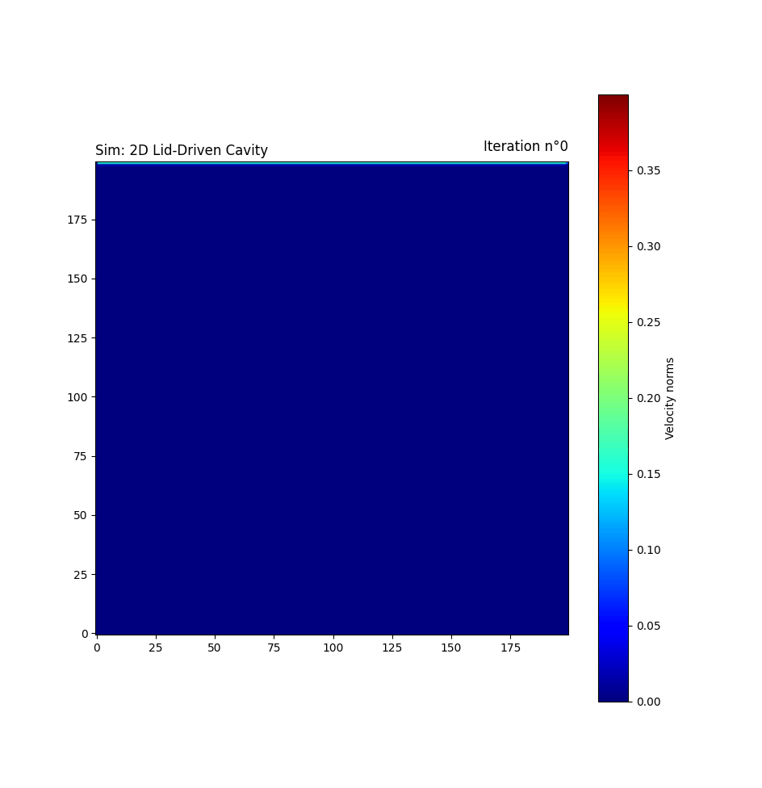
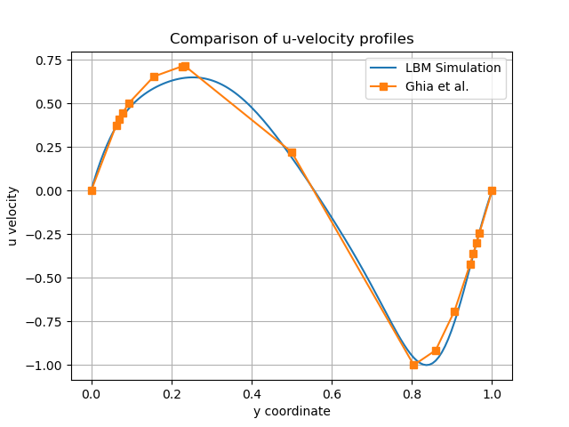
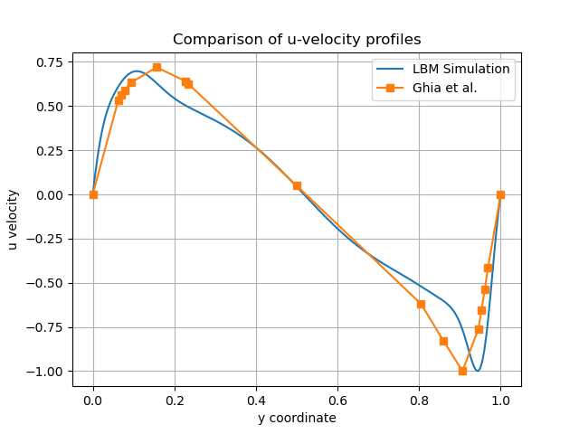
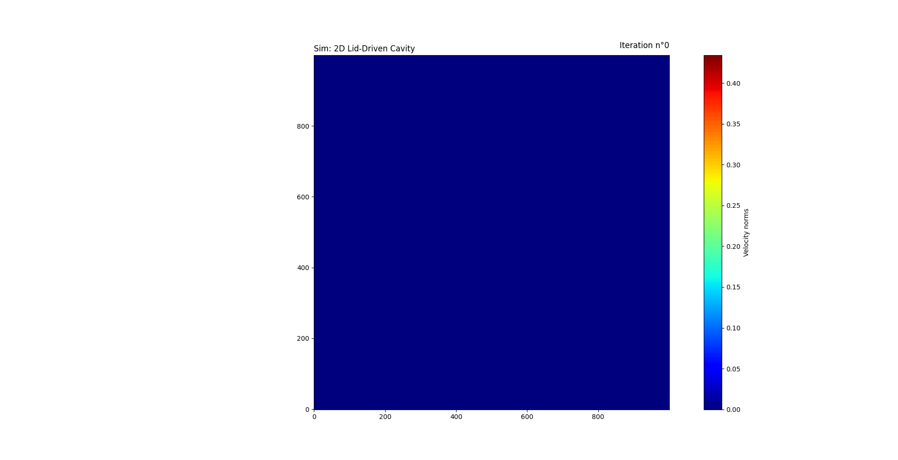
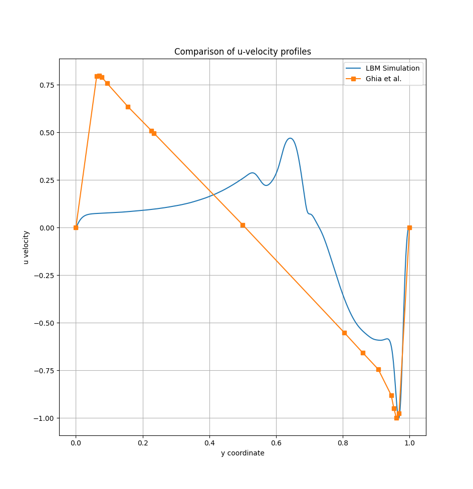

# Lattice Boltzmann Method

> The project is being actively developed and big changes are coming to the code structure.
> Therefore the current README is OUTDATED and instructions might not work!

<!--toc:start-->
- [Lattice Boltzmann Method](#lattice-boltzmann-method)
  - [Introduction](#introduction)
    - [Physical and Mathematical Model](#physical-and-mathematical-model)
    - [Stability considerations](#stability-considerations)
- [Further Model Description](#further-model-description)
  - [D2Q9 velocity set](#d2q9-velocity-set)
  - [Boundary Conditions](#boundary-conditions)
    - [Stationary walls](#stationary-walls)
    - [Moving lid](#moving-lid)
  - [The Time Step Algorithm](#the-time-step-algorithm)
    - [Key Parameters](#key-parameters)
  - [Output files](#output-files)
  - [Parallelization](#parallelization)
    - [Parallelization strategy](#parallelization-strategy)
      - [Parallelization Effect](#parallelization-effect)
  - [Run the Simulation](#run-the-simulation)
    - [Build](#build)
    - [Running the Simulation](#running-the-simulation)
      - [Configuration File](#configuration-file)
    - [Visualize the results](#visualize-the-results)
  - [References](#references)
<!--toc:end-->

This hands on objective is to implement the Lattice Boltzmann Method and applying it to solve the 2D lid-driven cavity problem.

The velocity set used is the common D2Q9, and as collision operator the Bhatnagar-Gross-Krook (BGK) was selected.

## Introduction

The Lattice Boltzmann equation originated from the description of the dynamics of a gas on a mesoscopic scale;
though it is possible to define a relation with the equations of fluid dynamics on the macroscale.
Therefore, from a solution of the Boltzmann equation for a given case it is usually possible to find a solution to the
Navier-Stokes equations for the same case[^1].

[^1]: Since the Boltzmann equation is more general, it has also solutions that do not correspond to Navier-Stokes solutions.

Even though the Boltzmann equation is analitically more difficult to solve than the NSE, its numerical scheme is
simpler and this is why it is frequently used in numerical problems of CFD simulations.

### Physical and Mathematical Model

The Lattice Boltzmann Method (LBM) is a numerical approach derived from the Boltzmann kinetic equation.
//Macroscopic fluid behavior emerges through a Chapman–Enskog expansion, recovering the incompressible Navier–Stokes equations in the low Mach number limit.//

As a collision operator, we used the BGK operator, which introduces a single relaxation time $\tau$, which controls the kinematic viscosity of the fluid according to: $ν = (c_s)^2 (τ − 1/2)$. With $c_s^2 = 1/3$, this becomes:
$\tau = 3\nu + 0.5$.

This relation is used directly in the code, where the inverse relaxation time is implemented as $1/\tau = 2 / (6\nu + 1)$.

### Stability considerations
Numerical stability of the BGK scheme requires $\tau > 0.5$, because as the Reynods number increases, the kineatic viscosity $\nu$ decreases and $\tau$ approaches the stability limit. For this reason:
- high Reynolds number simulations require sufficient grid resolution;
- the lid velocity must remain small in lattice units;
- density fluctuations must remain small.

Moreover, stability depends upon density. In _compute_rho_u_, we calculate $\rho += f[...]$, then $ux += dirx[i]*f[...]$, $uy += diry[i]*f[...]$, and lastly we _divide_ by $\rho$, so $u = ux/ \rho$, $v = uy/\rho$. If $\rho$ is too small, the macroscopic velocity $u$ explodes, giving us instability. 

## Further Model Description

The lattice Boltzmann method revolves around the _discrete-velocity distribution function_ $f_{i}(x,t)$, 
often called the particle _populations_.

This density function is used to describe how the fluid behaves on a mesoscopic (micro+macro) scale,
through the modeling of collisions of particles and their movement between different _cells_.

The discretized version of the Lattice-Boltzmann equation in velocity and time is:

$$f_{i}(x + c_{i}\Delta{t},t + \Delta{t})=f_{i}(x,t) + \Omega_{i}(x,t)$$

in which:

- $c_{i}$ is the speed at which particles move to a neighbouring point;
- $\Omega_{i}$ is the collision operator.

As previously stated, the collision operator used in this hands-on is the Bhatangar-Gross-Krook (BGK) operator:

$$ \Omega_{i}(f) = -\frac{f_{i}-f^{eq}_{i}}{\tau} \Delta{t}$$

with $\tau$ the relaxation time and $\Delta{t}$ the time step.

The equilibrium (computed explicitely in `init_equilibrium` and `collide`) is given by:

$$ f^{eq}_{i}(x,t) = 
w_{i} \rho (1 + \frac{u * c_{i}}{c_{s}^2}  
+ \frac{(u * c_{i})^2}{2c^4_{s}} - \frac{u*u}{2c^2_{s}}$$

in which:

- $w_{i}$ is the weight and $\rho$ the density
- $c_{i}$ represents the set of discrete particle velocities;
- $u$ represents the macroscopic fluid velocity;
- $c^2_{s} = (1/3)\frac{\Delta{x}^2}{\Delta{t}^2}$ determines the relation between the pressure and the density (in basic isothermal LBE).

> The latter of these factor does't need to be explicitly calculated in the algorithm.

## D2Q9 velocity set

In the project, we used the standard D2Q9 lattice, i.e. 9 discrete particle velocities:
- 1 rest population
- 4 axis-aligned populations
- 4 diagonal populations

In lattice units (Δx = Δt = 1), the discrete velocities $c_i = (cix, ciy)$ and the corresponding lattice weights $w_i$
are typically chosen as follows:

| i | cix | ciy | Meaning        | wᵢ   |
|--:|----:|----:|----------------|------|
| 0 |  0  |  0  | rest           | 4/9  |
| 1 | +1  |  0  | east           | 1/9  |
| 2 |  0  | +1  | north          | 1/9  |
| 3 | -1  |  0  | west           | 1/9  |
| 4 |  0  | -1  | south          | 1/9  |
| 5 | +1  | +1  | northeast      | 1/36 |
| 6 | -1  | +1  | northwest      | 1/36 |
| 7 | -1  | -1  | southwest      | 1/36 |
| 8 | +1  | -1  | southeast      | 1/36 |

These coefficients are stored in the code as:
- `ndir` (number of directions)
- `dirx[i]`, `diry[i]` (discrete velocity components)
- `wi[i]` (lattice weights)

For the standard D2Q9 lattice, the lattice speed of sound is:
$(c_s)^2 = 1/3$ (in lattice units), which guarantees second-order isotropy and correspondence between the macroscopic equations of LBM and the incompressible Navier–Stokes equations.

## Boundary Conditions

No-slip boundary conditions are enforced using a bounce-back scheme on the stationary walls. The moving lid is implemented through a modified bounce-back formulation that injects momentum corresponding to the prescribed lid velocity.

### Stationary walls

The left, right, and bottom walls are treated as no–slip boundaries: when a particle reaches the wall, it bounces back. Incoming populations are reflected into their opposite directions, enforcing zero velocity at the wall.

### Moving lid

The top wall moves with a prescribed horizontal velocity $u_lid$. This is implemented by:
- reconstructing the local density from known populations after streaming,
- modifying the unknown populations to impose the desired wall velocity.

## The Time Step Algorithm

The LBM algorithm consists of a cyclic sequence of operations; each cycle
corresponds to one time step. The substeps are:

1. Perform the streaming;
2. Apply boundary conditions;
3. Compute the macroscopic _moments_ $\rho(x,t)$ and $u(x,t)$ from $f_{i}(x,t)$;
4. Compute the equilibrium $f^{eq}_{i}(x,t)$;
5. Compute the collision operation;
6. Write the macroscopic fields.
7. Increase time step and check convergence.

### Key Parameters

- Reynolds Number: $Re$
- Kinematic viscosity: $\nu =\frac{u_{lid}L_x}{Re}$ 
- Relaxation time: $\tau = 3\nu +0.5$

## Output files

The numerical results are validated against the benchmark solutions of Ghia et al. (1982) for the lid-driven cavity problem. The simulation produces two output files:

frames/norms_*.txt
In the file there are the velocity magnitudes, as well as the grid dimensions `Nx` and `Ny`; notice that data is written every `SKIP_STEP` time steps.

data/data_*.txt
This file is written for benchmark validation against the reference solutions that we have in Ghia et al., 1982.


## Parallelization
The Lattice Boltzmann Method is well-suited for parallelization because of its locality of operations: this means that, at each time-step, most computations involve only data stored at a single lattice node/its neighbours.

Here we provide two versions, a sequential one and a OpenMP-parallel one. OpenMP is used to exploit data parallelism over the lattice nodes, since most LBM kernels update each cell independently.

### Parallelization strategy

The parallelization is based on domain-wide data parallelism, since each lattice node $(x, y)$ can be updated independently during:
  - computation of macroscopic quantities (_compute_rho_u_);
  - collision step (_collide_);
  - initialization routines.

This is possible because:
- the BGK collision operator is purely local;
- macroscopic moments depend only on populations stored at the same node. Each iteration writes to `rho[x,y]`, `ux[x,y]`, `uy[x,y]` only, so iterations are independent.

As a result, double loops of the form:
#pragma omp parallel for collapse(2)
for (y = 0; y < Ny; ++y)
  for (x = 0; x < Nx; ++x)
are best suitable for parallelization, because we need independence among different iterations. Particularly speaking, the functions _compute_rho_u_ and _collide_ are embarassingly parallel.

#### Parallelization Effect

The results of the parallelized section can be seen in the following graphs:

Here the line in red represents the speedup achieved; the line in blue is the
time calculated in seconds.

The size of the problem is a 129x129 grid with Reynolds number 100 at 10000 steps


Here the line in blue represents the time in seconds.

The sizes of the problems are:

- 50x50 grid Re = 100
- 100x100 grid Re = 100 
- 150x150 grid Re = 500
- 200x200 grid Re = 500
- 250x250 grid Re = 1000
- 300x300 grid Re = 1000


## Run the Simulation

### Build

To build the executable run:

`cmake -B build/`

`make -C build/ [-j]`

### Running the Simulation

To run, enter in directory `build/` and run:

`./lbm-2-lbm <path/to/configuration_file.txt>`

#### Configuration File

The configuration file should have the following structure:

```
# Line Comment
Nx 100
Ny 100
Re 100
U_lid 0.1
Nsteps 5000
Nframes 50
out_norm out/norm.txt
out_bench out/data.txt
Col BGK

Nx 200
Ny 200
Re 100
U_lid 0.1
Nsteps 5000
Nframes 0
out_norm out/norm_2.txt
out_bench out/data_2.txt
Col BGK
```

Two simulations should be separated by at least a whiteline (for clarity purposes).\
All parameters must be explicitely set, there are no default values and no checks for missing
parameters.\
The structure cannot be modified (otherwise a parsing error will pop up).\

### Visualize the results

The simulation outputs are designed to be post–processed using the provided Python scripts.  
All output files are written in the project root directory when the executable is launched from `build/`.

The main output file produced by the solver is `vel_norms.txt`, that contains:
- the grid dimensions `Nx` and `Ny` in the first two lines;
- the velocity magnitude $|\mathbf{u}| = \sqrt{u_x^2 + u_y^2}$  
  at every lattice node, written every `SKIP_STEP` iteration.

To visualize the evolution of the flow field, run: 
bash
python frameVisualize.py

Lastly, the following animation shows the time evolution of the velocity magnitude for the lid-driven cavity simulation.<p align="center">
  
  
</p>

<p align="center">
  
  
</p>

<p align="center">
  
  
</p>

## References

- T. Krüger et al., *The Lattice Boltzmann Method*, Graduate Texts in Physics, Springer.
- U. Ghia, K. N. Ghia, C. T. Shin, JCP (1982).

---

[Alessandro Frisone](https://github.com/DatemiUn30L) |
[Corrado Sciancalepore](https://github.com/CorradoSciancalepore) |
[Elisa Antonioli](https://github.com/ElisaAntonioli) |
[Chiara Nonino](https://github.com/ChiaraNonino) |
[Gabriele Santandrea](https://github.com/Gab-San)


