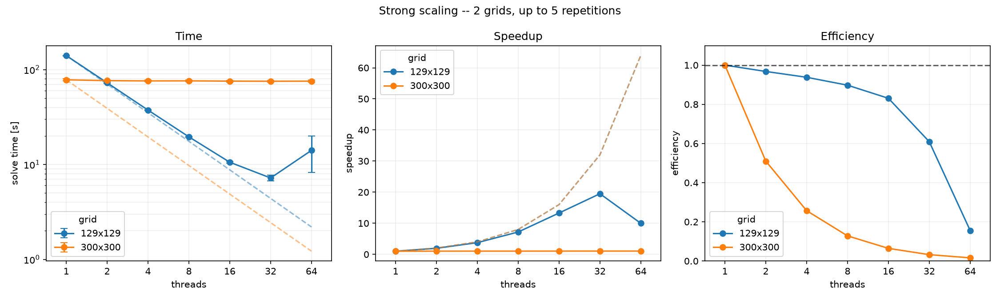
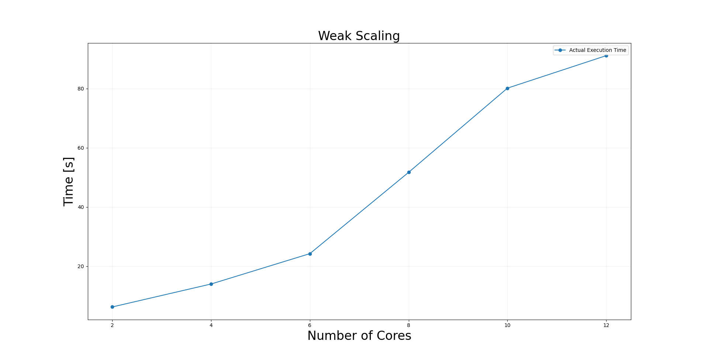
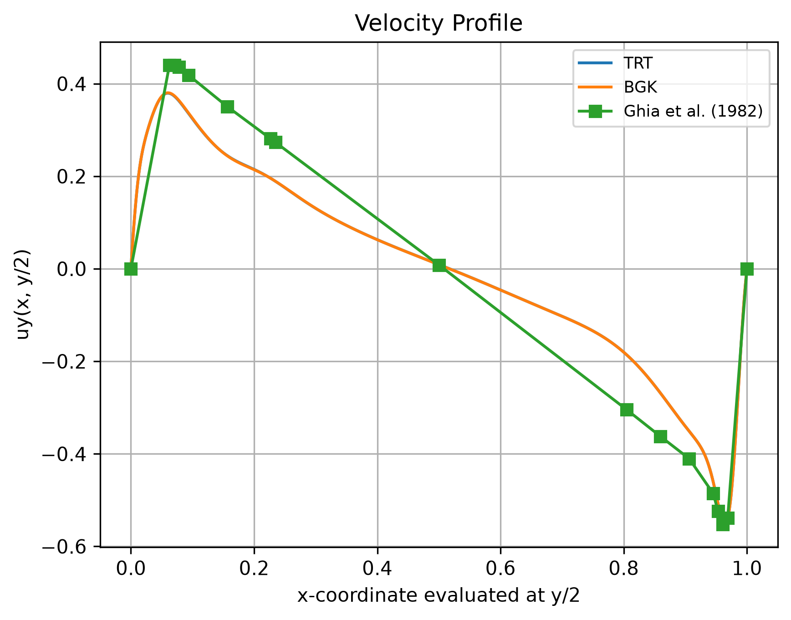
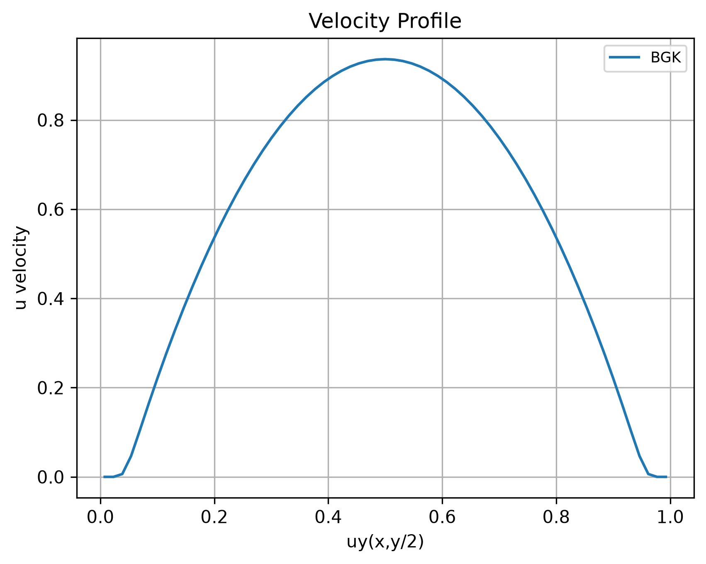

# lbm-simulation-lib

A header-only C++17 library for **Lattice Boltzmann Method (LBM)** fluid
simulations, with an OpenMP and a CUDA backend, 2D and 3D velocity sets,
pluggable collision operators and boundary conditions, and built-in error
estimation against analytical solutions and the Ghia et al. (1982) benchmark.

<!--toc:start-->
- [Introduction](#introduction)
  - [What the library is](#what-the-library-is)
- [Properties and features](#properties-and-features)
- [Installation and configuration](#installation-and-configuration)
  - [Requirements](#requirements)
  - [Build](#build)
  - [CMake options](#cmake-options)
  - [Python tooling](#python-tooling)
- [Usage and simulation model](#usage-and-simulation-model)
  - [Anatomy of a simulation](#anatomy-of-a-simulation)
  - [Configuration files](#configuration-files)
  - [Running a simulation](#running-a-simulation)
  - [Output files and visualization](#output-files-and-visualization)
- [Architecture Overview](#architecture-overview)
  - [The time step algorithm](#the-time-step-algorithm)
- [Embedding the library in a CMake project](#embedding-the-library-in-a-cmake-project)
- [Design and performance](#design-and-performance)
  - [Parallelization strategy](#parallelization-strategy)
  - [Scaling results](#scaling-results)
- [Error estimation](#error-estimation)
  - [Against an analytical solution](#against-an-analytical-solution)
  - [Against the Ghia benchmark](#against-the-ghia-benchmark)
- [Simulation results](#simulation-results)
  - [Lid-driven cavity at Re = 7500](#lid-driven-cavity-at-re--7500)
  - [Pipe flow in 3D](#pipe-flow-in-3d)
  - [Lid-driven cavity in 3D](#lid-driven-cavity-in-3d)
- [Documentation and report](#documentation-and-report)
- [References](#references)
- [License](#license)
- [Authors](#authors)
<!--toc:end-->

## Introduction

### Project Proposal

The Lattice Boltzmann equation describes the dynamics of a gas at the
*mesoscopic* scale; through a Chapman-Enskog expansion its solutions recover
the incompressible Navier-Stokes equations in the low-Mach limit. The
Boltzmann equation is analytically harder than the NSE, but its numerical
scheme is far simpler and highly local, which is why it is a popular choice
for CFD codes -- and an excellent target for parallelization.

**Project Proposal**

`lbm-simulation-lib` grew out of an AMSC hands-on on the 2D lid-driven cavity
and was extended into a modular and extensible simulation library:

- 2D **and** 3D problems (`D2Q9`, `D3Q19`, `D3Q27`) :white_check_mark: ;
- two collision operators (BGK, TRT) :white_check_mark:;
- two execution backends (OpenMP, CUDA) behind a common 
  solver interface :white_check_mark:;
- domain-face and immersed-obstacle boundary conditions 🔶;
- error estimation against analytical solutions and reference benchmarks 🔶.

> 🔶: features not included in our project proposal, but which 
> stem from the architectural choices.


> We strongly recommend running 3D simulations only with CUDA as the bulk of the 
> computation grows extremely fast as the grid becomes large and OpenMP
> cannot guarantee fast enough computation on CPUs.
>
> This is an HW limit more than a software and parallelization limit.

**The Library**

The core library itself is header-only (`include/lbm-sim/`); the executables under
`simulations/` are *examples* of how to drive it -- lid-driven cavity, Couette
flow, Poiseuille flow, flow past an obstacle.

There are two more modules that come bundled with it: 
- a configuration module that uses [toml](https://toml.io/en/) as backend;
- a logging module that uses either [quill](https://github.com/odygrd/quill) 
  or `ostream` as backends.

Both modules are completely opt-out (see [below :point_down:](#cmake-options) and 
do not alter the core library's functionalities.

> :warning: When logging is **DISABLED** actual logging macros are 
> replaced by no-ops that are then optimized out if using any optimization flag 
> (as in happens **Release** mode).

This library also offers:
- asynchronous output (raw binary, or a VTK series for ParaView).

> :warning: For 3D even though AsynchronousBinaryWriter can generate an output, 
> we have no post-processing scripts in place to parse and visualize it. \
> Therefore for 3D simulations stick with .vtk outputs.

## Properties and features

| Area | What is available |
|------|-------------------|
| Dimensions | 2D and 3D, selected by the `dim` template parameter (checked against the velocity set) |
| Velocity sets | `D2Q9`, `D3Q19`, `D3Q27` ([`core/velocity-sets.hpp`](include/lbm-sim/core/velocity-sets.hpp)) |
| Collision operators | `CollisionModel::BGK`, `CollisionModel::TRT` (`MRT` is reserved, currently a `static_assert`) |
| Backends | `ExecutionBackend::OPEN_MP` (`OpenMPSolver`), `ExecutionBackend::CUDA` (`CUDASolver`, opt-in) |
| Boundary conditions | Rigid-wall and moving-wall bounce-back, periodic, pressure-periodic inlet/outlet -- per domain face (`Solid::DomainBC`) or per immersed obstacle (`Solid::ObstacleData`) |
| Obstacles | Rasterized from analytic shapes: `Segment`, `Circle`, `Parallelogram`, `Airfoil` (2D only), `CylindricalShell` (3D only) through `CollisionDetection::CollisionArea` |
| Output | `AsyncBinaryWriter` (raw binary, background thread) and `VtkWriter` (`.vti` frames + a `.pvd` series for ParaView) |
| Configuration | TOML files parsed with [toml++](https://github.com/marzer/tomlplusplus), validated against the binary's own dimension, operator and backend |
| Logging | Three interchangeable backends selected by `LBM_LOG_BACKEND`: [Quill](https://github.com/odygrd/quill), `ostream` (no dependency), or `none` (macros expand away); the active level is fixed at compile time |
| Profiling | Optional chrono instrumentation (`LBM_ENABLE_PROFILING`), dumped as CSV next to the profile output |
| Error estimation | `L1`, `L2`, `L2^2`, `Linf` norms against a user-supplied `functional::Function<dim>`, or against the Ghia et al. tables |
| Post-processing | Python scripts for animations, velocity profiles and scaling plots  |

## Installation and configuration

### Requirements

- **CMake** >= 3.18
- A **C++17** compiler with **OpenMP** support (GCC, Clang, or MSVC -- MSVC
  builds use `/openmp:experimental`)
- **Git** and network access at configure time, **unless** both optional
  dependencies are disabled: Quill (`v12.1.0`) is fetched only when
  `LBM_LOG_BACKEND=quill` (the default) and toml++ (`v3.4.0`) only when
  `LBM_ENABLE_CONFIG=ON` (the default)
- *Optional:* **CUDA Toolkit**, for the CUDA backend
- *Optional:* **Doxygen**, for the documentation targets
- *Optional:* **Python 3** with `numpy` and `matplotlib`, for post-processing

### Build

```bash
git clone https://github.com/Gab-San/lbm-simulation-lib.git
```

```bash
cmake -S . -B build && cmake --build build -j
```

Every `.cpp` under `simulations/` becomes an executable named after its file,
built into `build/simulations/`. With the CUDA backend enabled, every `.cu`
becomes an executable prefixed with `cuda_`:

```bash
cmake -S . -B build -DLBM_ENABLE_CUDA=ON -DCMAKE_CUDA_ARCHITECTURES=75 && cmake --build build -j
```

`CMAKE_CUDA_ARCHITECTURES` defaults to `75` -- set it to match your GPU. The
CUDA build deliberately aligns `CMAKE_CUDA_HOST_COMPILER` with
`CMAKE_CXX_COMPILER` (except under the Visual Studio generators), so that host
code compiled by `nvcc` and the rest of the project agree on one OpenMP
runtime.

### CMake options

| Option | Default | Meaning |
|--------|---------|---------|
| `LBM_ENABLE_CONFIG` | `ON` | Build the TOML configuration support (fetches toml++) |
| `LBM_ENABLE_PROFILING` | `OFF` | Compile the chrono-based profiling instrumentation (`LBM_PROFILING`); required for the CSVs the scaling plots are built from |
| `LBM_ENABLE_LOGGING` | `ON` | Emit log output; `OFF` forces `LBM_LOG_BACKEND=none` |
| `LBM_LOG_BACKEND` | `quill` | Logging backend: `quill` (fetched), `ostream` (no dependency), `none` |
| `LBM_LOG_LEVEL` | `INFO` | Compile-time active level: `TRACE_L3`, `TRACE_L2`, `TRACE_L1`, `DEBUG`, `INFO`, `WARNING`, `ERROR`, `CRITICAL` |
| `LBM_BUILD_SIMULATIONS` | top-level | Build the executables under `simulations/`; off by default when the project is embedded |
| `LBM_BUILD_DOCS` | top-level | Configure the `docs/` Doxygen targets; off by default when the project is embedded |
| `LBM_SANITIZE` | *(empty)* | Sanitizers to build with: `address`, `undefined`, `thread`, `leak` (comma- or semicolon-separated) |
| `LBM_ENABLE_CUDA` | `OFF` | Enable the CUDA language, build `lbm-sim-cuda` and the `cuda_*` executables |
| `CMAKE_CUDA_ARCHITECTURES` | `75` | Target GPU architecture(s) |
| `CMAKE_CUDA_HOST_COMPILER` | `CMAKE_CXX_COMPILER` | Host compiler driven by `nvcc`; override only for host compilers `nvcc` rejects |


> :warning: Enabling profiling automatically disables the writers;
> the output files and folders might be created but they will be empty.


Log statements below `LBM_LOG_LEVEL` are compiled out entirely, so a release
run pays nothing for them:

```bash
cmake -S . -B build -DLBM_LOG_LEVEL=DEBUG
```

#### CMake presets

There are also some presets that one can use. To list them:
`cmake --preset list`
and then to run them:
`cmake --preset <preset-name>`

**Default Generator**: `Ninja` for its compatibility.

To change generator use the flag: 
```bash
-DCMAKE_GENERATOR=<generator>
```

for example:
```bash
cmake --preset release -DCMAKE_GENERATOR="Unix Makefiles"
``` 

will use `make` as backend.


| *Options x Preset* | *debug*  | *release* | *bench* | *profiling* |
| ------------------ | ------- | ---------  | ------- | ----------- |
| `CMAKE_BUILD_TYPE` | `Debug` | `Release`  | `Release` | `Release` |
| `LBM_ENABLE_CONFIG` | `ON` | `ON` | `ON`  | `ON` |
| `LBM_ENABLE_PROFILING` | `OFF` | `OFF`    | `ON` | `ON` |
| `LBM_ENABLE_LOGGING` | `ON` |  `ON` | `ON`| `ON` |
| `LBM_LOG_BACKEND` | `quill` | `quill`     | `none` | `quill` |
| `LBM_ENABLE_CUDA` | `OFF` |`OFF` | `ON`   | `OFF` |


> Presets **cuda-debug** and **cuda** are the respective of **debug and **release**
> with CUDA activated.

### Python tooling

```bash
python -m venv .venv && pip install -r scripts/py/requirements.txt
```

Python scripts live in `scripts/py` folder; the two useful ones are:

- `scripts/py/visualize_profile.py` to visualize `.dat` profile outputs;
- `scripts/py/visualize_frames.py` that generates an animation from the binary
  writer output.

See [below :point_down:](#output-files-and-visualization)

## Usage and simulation model

### Anatomy of a simulation

A simulation main is short and always follows the same steps. Condensed from
[`simulations/openmp/couette_d2q9_bgk.cpp`](simulations/openmp/couette_d2q9_bgk.cpp):

```cpp
using namespace lbm;
using types::DimPoint;

// --- 1. READ THE CONFIGURATION FILE (OPTIONAL) ---------------------------
if (argc < 2) {
  config::print_usage(argv[0]);
  return 1;
}

// --- 2. SET UP THE LOGGER ------------------------------------------------
logging::setup();
logging::Logger *main_logger = logging::create_or_get_logger("main");
// If the logger is not set up nothing will show on screen.
// This does not mean that logging functions will be 
// optimized out or skipped!

std::vector<config::SimulationConfig<DIM>> configs;
try {
  configs = config::parse_config<DIM>(argv[1]);
} catch (const config::ConfigError &err) {
  LBM_LOG_ERROR(main_logger, "Config Error {}", err.what());
  return 1;
}

// --- 3. RUN ONE SIMULATION PER CONFIGURATION -----------------------------
for (const auto &cfg : configs) {
  const DimPoint<DIM> grid_size(cfg.grid_size);
  utils::Vector<double, DIM> u0(cfg.u0);

  // --- 4. DESCRIBE THE DOMAIN FACES --------------------------------------
  // Couette: rigid bottom wall, moving top wall, periodic left and right
  // sides. Corners still belong to the horizontal faces: the wrap on x
  // happens first, then the y face claims the link.
  Solid::DomainBC<DIM> dbc{};
  dbc.low(0) = Solid::PERIODIC;        // x = 0
  dbc.high(0) = Solid::PERIODIC;       // x = nx-1
  dbc.low(1) = Solid::BB_RIGID_WALL;   // y = 0
  dbc.high(1) = Solid::BB_MOVING_WALL; // y = ny-1

  // --- 5. BUILD THE SOLID MASK -------------------------------------------
  // No obstacle immersed in the fluid: the mask is entirely types::FLUID.
  types::solid_mask_t solid_mask =
      Solid::compute_solid_mask<DIM>({}, grid_size);

  // --- 6. RUN THE SIMULATION ---------------------------------------------
  // frames_out is the DIRECTORY; the file basename comes from the config
  // name, so different runs in the same directory do not overwrite each
  // other.
  std::shared_ptr<AsyncBinaryWriter> writer =
      std::make_shared<AsyncBinaryWriter>(cfg.frames_out);

  LBMSimulation<DIM, D2Q9, COLLISION> simulation(
      grid_size, std::move(solid_mask), {}, dbc,
      CollisionParams<DIM, COLLISION>(cfg.reynolds, grid_size, u0));
  simulation.attachListener(writer);

  OpenMPSolver<DIM, D2Q9, COLLISION> solver(cfg.niters, cfg.nframes);
  solver.attachListener(writer);

  simulation.solve(solver);

  simulation.output(cfg.profile_out.c_str(),
                    functional::extract_dx_profile_along_y_center);

  // --- 7. ESTIMATE THE ERROR (see the dedicated section) -----------------
  const double H = static_cast<double>(grid_size.y - 1);
  const auto exact_solution = analysis::CouetteSolution2D(H, u0.dx);
  const double err_l2 =
      simulation.compute_error(analysis::NormType::L2, exact_solution);
  LBM_LOG_NOTICE(main_logger, "{} error: {}",
                 analysis::to_string(analysis::NormType::L2), err_l2);

  simulation.detachListener(writer);
  solver.detachListener(writer);
}
```

The writer must be attached to **both** objects: `LBMSimulation` emits the
grid-size header, the solver emits the velocity-norm frames, and they are two
distinct `DataObservable`s. Detach it from both at the end of a run, so the
next configuration in the loop starts from a clean listener list.

Moving to 3D means changing three things: `DIM`, the velocity set (`D3Q19` or `D3Q27`). 
See [`lid_cavity_d3q19_bgk.cu`](simulations/cuda/lid_cavity_d3q19_bgk.cu).

### Configuration files

Configurations are TOML files holding an array of `[[conf]]` tables -- one run
each -- parsed by `lbm::config::parse_config<dim>()`, which returns a
`std::vector<config::SimulationConfig<dim>>`:

```toml
[[conf]]

[conf.lattice]
size = [129, 129]          # [nx, ny] in 2D, [nx, ny, nz] in 3D

[conf.physics]
reynolds = 100.0           # > 0
init_vel = [0.1, 0.0]      # reference velocity, one component per dimension

[conf.solver]
niters  = 100000           # > 0
nframes = 200              # must not exceed niters

[conf.output]
frames  = "out/frames.out"
profile = "out/profile.dat"

[conf.backend]
n_threads = 8              # optional; 0 means "let the backend decide"
```

Every field is mandatory except `nframes` and `n_threads`, which both default
to `0`. The dimension, the collision operator and the backend are **not**
fields: they are compile-time parameters of the binary, so a `lattice.size` of
the wrong length is rejected instead of being reinterpreted. Failures raise
`config::ConfigError` with a message naming the offending field, so a main can
distinguish a bad configuration (print, exit 1) from an error raised during the
solve. Repeat the `[[conf]]` block to describe several runs in one file --
`configs/profiling.toml` is a thread-count sweep written that way.

### Running a simulation

Every executable under `simulations/` takes the path of a `.toml` as its only
argument, and prints a usage line when called without one:

```bash
./build/simulations/couette_d2q9_bgk configs/example.toml
```

```bash
./build/simulations/cuda_lid_cavity_d2q9_bgk configs/lid_cavity_cuda.toml
```

The two `obstacle_flow_2d_bgk` mains are the exception: their geometry is
hardcoded, so they take no configuration file.

Benchmark tables and the `configs/` directory are passed to the executables as
absolute paths at configure time (`LBM_BENCHMARKS_DIR`, `LBM_CONFIGS_DIR`), so
a binary finds its input data from any working directory and editing a `.toml`
takes effect without recompiling. Output paths, on the other hand, are relative
to the working directory, and the files under `configs/` write to `out/...`:
launch from `build/simulations/` to collect the output under
`build/simulations/out/`, or point `[conf.output]` somewhere else.

**CUDA executables**

> CUDA executables mainly purpose is to relieve the Colab Notebooks 
> of long chains of commands.

The CUDA executables can be run in sequence, one log per run, with:

```bash
./run_cuda_simulations.sh
```

```bash
./run_cuda_simulations.sh lid_cavity_d2q9_bgk
```

With no argument it runs every `cuda_*` executable found in
`build/simulations`; a name is accepted with or without the `cuda_` prefix, and
`BIN_DIR` and `LOG_DIR` override the defaults.

### Output files and visualization

There are two output products, both written off the simulation thread:

- **Frames** -- the velocity magnitude at every node, emitted every
  `niters / nframes` steps. `AsyncBinaryWriter` writes them as a raw binary
  stream (`nx`, `ny` [, `nz`] as `int32`, then one `float32` per node per
  frame); `VtkWriter` turns the same stream into one `.vti` file per frame plus
  a `.pvd` series that ParaView can open *while the run is still going*.
- **Profile** -- a 1D velocity profile along a centerline, written by
  `LBMSimulation::output()` with an extractor from `lbm::functional`. The file
  starts with a `%%profile <operator> <n> <u_ref>` ASCII header, followed by
  `float64` samples.

**Python tooling**

```bash
python scripts/py/visualize_frames.py out/norms_lid_cavity.bin -o cavity.gif
```

```bash
python scripts/py/visualize_profile.py output/lid_cavity_bgk_profile.dat benchmarks/ghia/data_y_100.txt --title "Re = 100" -o profile.png
```

```bash
python scripts/py/validate_outputs.py
```

- `visualize_frames.py` animates the raw binary frames;
- `visualize_profile.py`overlays one or more profiles (including the Ghia tables, which are already normalized by the lid velocity); 
- `validate_outputs.py` checks the produced files structurally and numerically -- headers, payload lengths, finite values, and duplicate output paths.

## Architecture Overview

The library is built around compile-time polymorphism, so that the dimension,
the velocity set and the collision operator cost nothing at run time:

```
LBMSimulation<dim, VelocitySet, CollisionModel>   owns the Lattice + CollisionParams
        |  solve(solver)
        v
SolverBase<dim, VelocitySet, CollisionModel, Backend>
        |-- OpenMPSolver<dim, VelocitySet, cm>
        `-- CUDASolver<dim, VelocitySet, cm>
                 uses CollisionStrategy<dim, VelocitySet, cm>   (BGK / TRT)

DataObservable ---notify---> IDataListener
        ^                        |-- AsyncBinaryWriter
        |-- LBMSimulation        `-- VtkWriter
        `-- SolverBase
```

Three deliberate choices shape the code:

- **Strategy for collision.** `CollisionStrategy` dispatches on the
  `CollisionModel` template parameter with `if constexpr`, so the collision
  kernel is inlined into the fused stream-collide loop; an unimplemented
  operator is a compile error, not a run-time branch.
- **Observer for output.** Solvers know nothing about file formats: they push
  raw byte chunks to listeners. Both writers drain a queue on a dedicated
  thread, so disk I/O overlaps with computation and the format can change
  without touching the solver.
- **O(1) boundary description.** Domain faces are at most six bytes regardless
  of resolution, and the per-node solid mask is 2 bytes per node -- about 1.4%
  of the population arrays on a 1000^2 grid, which keeps obstacle support
  essentially free.

A UML view of the project lives in
[`docs/report/LBM_UML.html`](docs/report/LBM_UML.html)
(editable source: `LBM_UML.drawio`).

- [**Velocity sets**](/docs/report/architecture.md#velocity-sets)
- [**Boundary conditions**](/docs/report/architecture.md#boundary-conditions)

### The time step algorithm

Each iteration of `OpenMPSolver::solve` performs:

1. streaming, with boundary conditions resolved link by link;
2. computation of the macroscopic moments `rho(x,t)` and `u(x,t)`;
3. computation of the equilibrium `f^{eq}_i(x,t)`;
4. collision;
5. every `niters / nframes` steps, emission of a velocity-norm frame to the
   attached listeners.

Steps 1-4 are fused into a single `update_stream_collide` pass over two
population buffers that are swapped at the end of the step, so populations are
read from one array and written to the other with no aliasing and no extra
copy. The macroscopic fields are materialized only on the steps that need them
(a frame step, or the last iteration).

## Embedding the library in a CMake project

`lbm-sim` is an `INTERFACE` (header-only) target that already carries its
include directory, OpenMP, the logging helper and toml++. The top-level
`CMakeLists.txt` adds `simulations/` only when the project is top level, so
consuming it as a subproject builds the library and nothing else.

With `FetchContent`:

```cmake
include(FetchContent)
FetchContent_Declare(
  lbm-simulation-lib
  GIT_REPOSITORY https://github.com/Gab-San/lbm-simulation-lib.git
  GIT_TAG        main
)
FetchContent_MakeAvailable(lbm-simulation-lib)

add_executable(my_sim my_sim.cpp)
target_link_libraries(my_sim PRIVATE lbm-sim)
```

Or with a vendored copy:

**Directory Structure**
```
my_project/
├── CMakeLists.txt
├── lbm-simulation-lib
└── main.cpp
```

**Minimal CMakeLists.txt**
```
cmake(VERSION 3.21)
project(my_project)

set(CMAKE_CXX_STANDARD 17)
set(CMAKE_CXX_STANDARD_REQUIRED ON)

add_subdirectory(lbm-simulation-lib)
add_executable(${PROJECT_NAME} main.cpp)
target_link_libraries(${PROJECT_NAME} PRIVATE lbm::sim) 
# If LBM_ENABLE_CUDA=ON link CUDA with lbm::sim-cuda
```

For the CUDA backend, configure the consuming project with
`-DLBM_ENABLE_CUDA=ON` and link `lbm::sim-cuda` instead: it pulls `lbm-sim` in
and adds relocatable device code plus the OpenMP flag for `nvcc`'s host pass.

## Design and performance

### Parallelization strategy

LBM parallelizes well because its operations are local: at each time step
almost every computation touches a single node and its immediate neighbours.
The collision step is *purely* local, and the macroscopic moments at a node
depend only on the populations stored there, so the node loop is embarrassingly
parallel:

```cpp
#pragma omp parallel for shared(lattice, part_stream) schedule(static)
for (int cell = 0; cell < area; ++cell) { /* ... */ }
```

The loops iterate over a flattened cell index and recover the coordinate with
`lbm::iteration::unflatten`, which keeps one `parallel for` for both 2D and 3D
instead of a `collapse(2)` / `collapse(3)` pair. The schedule is `static`:
every node costs the same, so a static split is both the cheapest and the one
that keeps a thread on the same slice of the lattice across iterations, which
is what makes the per-thread working set stay in cache.

The thread count comes from the OpenMP runtime unless a main sets it
explicitly. Only `profiling_lid_cavity_d2q9` does -- through
`BackendProperties<OPEN_MP>::setNumThreads()`, fed by `[conf.backend]
n_threads` -- so for every other executable it is the environment that decides:

```bash
OMP_NUM_THREADS=8 ./build/simulations/lid_cavity_d2q9_bgk configs/example.toml
```

The CUDA backend maps the same node loop onto the device, with the velocity set
uploaded to `__constant__` memory and the domain BC passed by value as a kernel
argument (`DomainBC` is trivially copyable by design).

### Scaling Results

#### How the numbers were measured

The timings come from the solver's own instrumentation, not from `time`: a
build configured with `-DLBM_ENABLE_PROFILING=ON` makes `OpenMPSolver` write
one row per run into a CSV, and the row kept here is the `solve_total` timer --
the wall time of the whole iteration loop, with initialization, allocation and
output excluded. The profiling main also sets `setBenchmarkMode(true)`, which
suppresses frame emission, so the writer thread is not part of the measurement.

The sweeps are the `[[conf]]` lists in:
 - [`configs/profiling.toml`](configs/profiling.toml) (strong)
 - [`configs/profiling_couette.toml`](configs/profiling_couette.toml) (strong)
 - [`configs/weak_scaling.toml`](configs/weak_scaling.toml) (weak)

the thread count is dynamically set through the configuration entry 
`[conf.backend].n_threads`, applied through `BackendProperties<OPEN_MP>::scopedApply()`. 

For the **strong scaling** we have set up two different 2D problems:
1. a lid cavity problem with:
  - grid size: 129x129;
  - Reynolds number: 100;
  - number of iterations: 100000.
2. a couette problem with:
  - grid size: 300x300;
  - Reynolds number: 200;
  - number of iterations: 100000.

For the **weak scaling** we have set up one configuration on a 2D 
lid cavity simulation.

> NOTE: the configuration results is set up to 64 threads but the simulations with 
> 32 and 64 threads were lost and we did not manage to re-run them yet.

Each repetition is a separate PBS job (`scripts/cpu_job.pbs`, one node,
`ncpus=64`, 30 minutes of walltime), submitted N times:

```bash
./scripts/submit_simulations.sh build/simulations/profiling_lid_cavity_d2q9 configs/profiling.toml 5
```

```bash
python scripts/py/plot_strong.py results -o docs/report/assets/strong_scaling.png
```

`plot_strong.py` and `plot_weak.py` walk `results/<JOBID>/prof/` recursively,
average the repetitions, and write both the figure and the summary table as
images. Speedup and efficiency are always measured against the *smallest thread
count present in that series*, never against a hardcoded 1.

#### Strong scaling -- fixed 129x129 grid



**Lid Cavity D2Q9**


| threads | mean [s] | std [s] | speedup | efficiency | MLUPS |
|--------:|---------:|--------:|--------:|-----------:|------:|
| 1  | 140.459 | 0.792 | 1.00  | 1.00 | 11.8 |
| 2  |  72.565 | 1.086 | 1.94  | 0.97 | 22.9 |
| 4  |  37.437 | 0.256 | 3.75  | 0.94 | 44.5 |
| 8  |  19.560 | 0.252 | 7.18  | 0.90 | 85.1 |
| 16 |  10.567 | 0.271 | 13.29 | 0.83 | 157.5 |
| 32 |   7.207 | 0.523 | 19.49 | 0.61 | 230.9 |
| 64 |  14.092 | 5.891 | 9.97  | 0.16 | 118.1 |


**Couette D2Q9**


| threads | mean [s] | std [s] | speedup | efficiency | MLUPS   |
|--------:|---------:|--------:|--------:|-----------:|--------:|
| 1       | 960.569  | 1.853   |  1.00   | 1.00       | 9.37    |
| 2       |  482.318 | 3.188   |  1.991  | 0.996      | 18.66   |
| 4       |  246.033 | 0.198   |  3.904  | 0.976      | 36.58   |
| 8       |  126.055 | 0.449   |  7.620  | 0.953      | 71.4    |
| 16      |  66.827  | 2.367   |  14.374 | 0.898      | 134.68  |
| 32      |  41.643  | 2.005   |  23.067 | 0.721      | 216.122 |
| 64      |  40.523  | 1.657   |  23.704 | 0.370      | 222.1   |


MLUPS (million lattice updates per second) is
`nx * ny * niters / time`; it is the number to compare across grids, since
speedup alone hides the fact that the two rows below are not the same amount of
work.

What the curve says, in order:

- **Up to 16 threads the solver behaves as the algorithm promises.** 90% at 8
  threads and 83% at 16 for an embarrassingly parallel node loop is what an
  OpenMP `parallel for` over a fused stream-collide pass should give: there is
  no reduction, no critical section, and the only synchronization is the
  implicit barrier at the end of the loop.
- **32 threads still pays off, but the efficiency drops to 0.61.** Each thread
  is left with 16641 / 32 = 520 nodes, i.e. about 75 kB of populations -- small
  enough that the barrier at every one of the 100 000 iterations starts to
  weigh against the useful work per iteration.
- **64 threads is a regression, not a plateau**: the time goes *back up* from
  7.2 s to 14.1 s, and the standard deviation explodes from 0.5 s to 5.9 s
  (40% of the mean). A slower mean with an unstable spread is contention, not
  saturation. With 260 nodes per thread the loop body is shorter than the
  barrier that follows it, and if the 64 logical CPUs of the node are SMT
  siblings on fewer physical cores, two threads then fight for one set of
  execution units and one L1. The fix is not in the solver: bind the threads
  (`OMP_PROC_BIND=close`, `OMP_PLACES=cores`) and re-measure, and use a grid
  large enough that 64 threads have real work -- the weak-scaling sweep below
  shows the same node handling 4 million nodes without any of this.

**The 300x300 series in the figure did not scale at all**, and it is worth
saying explicitly why it should not be read as a result of the solver: its wall
time is 78.0 s on 1 thread and 75.5 s on 64, i.e. flat to within the noise, for
a speedup of 1.03. A parallel loop that is genuinely limited by memory
bandwidth still improves by a factor of several before flattening; a curve that
is flat *from the first doubling* means the extra threads never ran. Two facts
pin it down:

- the single-thread throughput of the two series is the same (11.8 MLUPS at
  129x129, 11.5 MLUPS at 300x300 once the iteration counts are taken into
  account), so the serial code path is identical;
- the 64-thread 300x300 run has the same throughput as its own serial run.

**The 300×300 series in the figure scales cleanly up to 32 threads and then stalls**, 
and it's worth spelling out why the last data point should be read as a bandwidth 
ceiling rather than a property of the solver: 

- wall time drops from 41.643 s at 32 threads to 40.523 s at 64, a 2.8% improvement for a doubling of thread count, pushing the speedup from 23.067 to just 23.704; 
- efficiency makes the picture unambiguous — it holds above 0.72 through 32 threads (0.996, 0.976, 0.953, 0.898, 0.721 at 2, 4, 8, 16, 32) and then collapses to 0.370 at 64;

A genuinely compute-bound loop would keep gaining share of the extra cores; 
a curve that flattens sharply on the *last* doubling after tracking near-ideal 
scaling up to that point is the signature of memory bandwidth saturating rather than 
the solver failing to parallelize. 
This is corroborated by throughput: 216.1 MLUPS at 32 threads versus 222.1 MLUPS at 64
— essentially the same delivered bandwidth despite twice the threads, 
meaning the additional 32 threads bought almost nothing.

---

Since the `n_threads` column of the CSV is the value *requested* through
`BackendProperties::getNumThreads()` and not one measured inside the parallel
region with `omp_get_num_threads()`, a job that was granted fewer CPUs than it
asked for -- or one whose threads were confined to a single core by the queue
-- is recorded as a 64-thread run regardless. Before that series is quoted
anywhere, re-run it on a job whose `select=...:ncpus=` matches the sweep, and
log `omp_get_num_threads()` from inside the region so the CSV records what was
actually used rather than what was asked for.

#### Weak scaling -- constant work per thread




| threads | grid | cells/thread | mean [s] | MLUPS | MLUPS per thread |
|--------:|------|-------------:|---------:|------:|-----------------:|
| 1  | 129x129   | 16641 | 141.774 | 11.7  | 11.7 |
| 2  | 183x183   | 16744 | 146.129 | 22.9  | 11.5 |
| 4  | 257x257   | 16512 | 146.945 | 45.0  | 11.2 |
| 8  | 365x365   | 16653 | 151.584 | 87.9  | 11.0 |
| 16 | 515x515   | 16577 | 151.768 | 174.8 | 10.9 |


The first five rows are a textbook weak-scaling sweep: the grid grows so that
every thread keeps about 16 600 nodes, and the ideal is a **flat** time curve.
It is flat to within 7% -- 141.8 s on one thread against 151.8 s on sixteen,
efficiency 0.934 -- which is the same story the strong-scaling curve tells from
the other side: the node loop itself parallelizes cleanly, and what little
slope there is comes from the growing footprint rather than from
synchronization.

## Error estimation

Two complementary facilities, both reachable from `LBMSimulation`.

### Against an analytical solution

Modelled on `dealii::VectorTools`: pass an exact solution and a norm type; the
discrete field and the grid are taken from the simulation itself.

```cpp
const analysis::PoiseuilleSolution2D exact(channel_height, u_max);
const double err = simulation.compute_error(analysis::NormType::L2, exact);
```

`analysis::NormType` covers `L1`, `L2`, `L2_squared` and `Linfty`.
`ErrorEvaluator<dim>::integrate_difference()` produces the per-cell error and
`compute_global_error()` reduces it in the requested norm; `compute_error()`
returns the **absolute** global error. Ready-made solutions are
`analysis::CouetteSolution2D` and `analysis::PoiseuilleSolution2D`; any other
case is a subclass of `functional::Function<dim>` overriding
`value(const Coordinate<dim> &)`.

### Against the Ghia benchmark

For the 2D lid-driven cavity, results are validated against Ghia, Ghia & Shin
(1982). The tables in [`benchmarks/ghia/`](benchmarks/ghia) hold the reference
centerline profiles for `Re = 100`, `1000` and `7500`, already normalized by
the lid velocity.

```cpp
const auto ghia_y = simulation.compute_ghia_error("benchmarks/ghia/data_y_100.txt");
// ghia_y.relative, ghia_y.absolute, ghia_y.norm_type
```

`compute_ghia_error()` compares `lattice.u` along the two centerlines with the
tabulated points, reduces them to a scalar in the requested norm (`L2` by
default) and returns both the absolute and the relative error in an
`analysis::NormErrorResult`. It is defined **only for `dim == 2`** -- the 3D
cavity has no tabulated equivalent here, so 3D runs are validated by exporting
the centerline profile and comparing it against external reference data.

Measured errors for both centerlines -- `Re = 1000` on a 200x200 grid, and the
Couette and Poiseuille cases against their analytical solutions -- are tabulated
in [`docs/report/error_results.md`](docs/report/error_results.md).

## Simulation results

Every profile below is produced the same way: the run writes a centerline with
`LBMSimulation::output()` and an extractor from `lbm::functional`, and
`scripts/py/visualize_profile.py` plots it. The script divides the samples by
the `u_ref` recorded in the `%%profile` header, which is the same normalization
the Ghia tables already use, so a curve that sits below the reference is
genuinely slower and not just scaled differently.

### Lid-driven cavity at Re = 7500

2D cavity, `D2Q9`, 2000x2000 nodes, TRT and BGK, compared against
`benchmarks/ghia/data_y_7500.txt` -- the vertical velocity along the horizontal
centerline, `v(x, ny/2)`, which is what
`functional::extract_dy_profile_along_x_center` extracts.

<p align="center">
  
</p>

https://github.com/user-attachments/assets/ac2f4b29-612d-4792-bb47-8280fb7cacb5

The shape is right: the profile leaves the left wall, peaks just inside it,
crosses zero at mid-cavity and reaches a deeper negative extremum near the
right wall -- the signature of the primary vortex, asymmetric in exactly the
direction Ghia's table is. Point by point:

| | simulation | Ghia et al. (1982) | difference |
|---|---:|---:|---:|
| positive peak (x ~ 0.06) | +0.38 | +0.4403 | -14% |
| zero crossing | ~0.50 | 0.50 (+0.008) | -- |
| negative extremum (x ~ 0.96) | -0.54 | -0.5522 | -2% |

Three things are worth reading off these two figures, in decreasing order of
how easy they are to get wrong:

- **BGK and TRT are indistinguishable at this scale.** In the comparison plot
  the green BGK curve is drawn over the blue TRT one and hides it completely --
  the legend entry is the only evidence TRT is there at all. That is the
  expected outcome, not a bug: the two operators differ in how they relax the
  antisymmetric moments, which shows up in the placement of *curved or
  obstacle* walls, and a square cavity resolved by 2000 nodes gives that
  difference nothing to act on. TRT earns its keep elsewhere -- on the pipe
  below, or at coarser resolutions where the wall position matters.
- **The straight segment of the orange curve between x = 0.23 and x = 0.80 is
  interpolation, not data.** Ghia's table has 17 points and only one of them
  (x = 0.5) lies in that interval; `visualize_profile.py` joins consecutive
  points with a straight line. Most of the apparent gap in the middle of the
  plot is therefore an artifact of the reference being drawn as a polyline. The
  number to quote is the one `compute_ghia_error()` returns: it interpolates
  the *simulation* onto the 17 tabulated abscissas and reduces the differences
  in `L2`, which is a comparison between 17 pairs of numbers rather than
  between two drawn curves.
- **The 14% deficit on the positive peak is real, and resolution is not the
  explanation.** At 2000 nodes across the cavity, one lattice spacing is 0.05%
  of the side: the near-wall extremum is resolved by tens of nodes, so this is
  not an under-resolved boundary layer. The likelier cause is that the run has
  not reached the steady state Ghia's tables describe. One flow-through time
  for a lid at `u = 0.1` on a 2000-node cavity is `L/u = 20000` steps, and a
  cavity at `Re = 7500` -- where the secondary corner vortices are still
  growing long after the primary one has formed -- needs *tens* of flow-through
  times to settle. The asymmetry of the error supports this: the extremum on
  the side the lid drives into (-2%) is already converged, while the one on the
  returning side, which is fed by the slower recirculation, is the one lagging.

> The configuration that produced these two figures is not in `configs/`: it
> was run with an ad-hoc grid and iteration count. Commit it as
> `configs/lid_cavity_7500.toml` -- without `niters` the convergence argument
> above cannot be checked, and the figures cannot be reproduced.

### Pipe flow in 3D

`D3Q19` on the CUDA backend
([`simulations/cuda/pipe_poiseuille_d3q19_bgk.cu`](simulations/cuda/pipe_poiseuille_d3q19_bgk.cu),
`configs/pipe_config*.toml`): a `CollisionDetection::CylindricalShell`
rasterized as the pipe wall inside a box, pressure-periodic inlet and outlet on
the `x` faces, rigid walls elsewhere. The profile is `u_x` along the `z`
centerline, from `functional::extract_dx_profile_along_z_center`.

<p align="center">
  
</p>

- The profile is the parabola Hagen-Poiseuille predicts across a diameter, and
  it is symmetric about the axis to within the line width -- which is the real
  test here, because nothing in the setup enforces symmetry: the wall is a
  rasterized cylinder, so a lopsided profile would have exposed a bias in how
  `compute_solid_mask()` walks the shell.
- **The flat zero shoulders at both ends are not stagnant fluid, they are solid
  nodes.** The extractor samples the full width of the *box*, and the pipe is
  inscribed in it: the two or three nodes at each end of the line sit between
  the box face and the cylinder wall. The fluid region is about 92% of the
  plotted line, and the profile does start from zero exactly at the shell, so
  bounce-back is placing the wall where the geometry says it is.
- The peak reaches 0.93 of the reference velocity that sets the viscosity, and
  the two obvious suspects are already ruled out by the main itself: it builds
  the effective radius as `r_eff = radius + 0.5`, so the half-cell wall offset
  is accounted for, and it rescales the Reynolds number by `ny / d_eff` before
  handing it to `CollisionParams`, whose viscosity is otherwise derived from
  the box side rather than the pipe diameter. What is left is the wall itself:
  a rasterized cylinder is a staircase, and bounce-back on a staircase is only
  first-order accurate for a curved boundary, so a few percent on a radius of
  about 30 nodes is the expected price. That is also the one place where TRT
  and an interpolated bounce-back would earn their keep.

> `profile_pipe_poiseuille_64_65_65_21_bgk.png` does not carry its parameters in the filename, and three
> pipe configurations are committed (`Re = 21` and `Re = 100` on 64x65x65),
> so which one it is cannot be recovered from the
> file. Renaming it to the convention the other figures use --
> `profile_pipe_d3q19_<nx>_<ny>_<nz>_<Re>_<operator>.png` -- costs nothing now
> and saves the next reader a guess.

### Lid-driven cavity in 3D

`D3Q19`, 200x200x200 nodes, `Re = 1000`, lid on the `z = nz-1` face
([`configs/lid_cavity_3d.toml`](configs/lid_cavity_3d.toml)). The animation is
the velocity magnitude on the exported frames, rendered with
`scripts/py/visualize_frames.py`.


There is no tabulated 3D counterpart to Ghia in `benchmarks/`, and
`compute_ghia_error()` is `dim == 2` only, so this case is validated
qualitatively -- the primary vortex forms under the lid and the corner
recirculations appear where they should -- and quantitatively only through the
exported centerline, which has to be compared against external reference data.
The same run is available as [`lid_cavity_3d.mp4`](https://drive.google.com/file/d/1LXoR7dcdQXW0F0D8UrwZvzgfBTKwPcxX/view?usp=sharing)
(the GIF is ten times larger than the MP4, so prefer the MP4 when linking it
from anywhere that plays video).

### Flow Around Immersed Obstacles: Circle, NACA Airfoil, and Generic Geometry

Three cases using the same domain structure — `BB_MOVING_WALL` on the left boundary as the source of motion, `OPEN_OUTFLOW` on the other three boundaries, and an immersed obstacle handled through `compute_solid_mask()` — are used to qualitatively validate the open boundary condition pipeline together with the sponge layer, as well as the geometry of the shapes themselves.

None of the three cases has a reference dataset comparable to Ghia et al. that can be used for point-by-point validation. The validation here is therefore visual, following the same approach used for the 3D cavity described above: the goal is to verify that the flow behaves as expected around the obstacle, rather than to match a tabulated reference profile.

#### Circle (`Circle_flow_2d_bgk.cu`)

https://github.com/user-attachments/assets/b32c35d0-7bdd-436b-bd8c-a7f785b08b41

The simplest of the three cases: a `CollisionDetection::Circle` is immersed in the channel. The video shows the formation of the wake behind the obstacle and the shedding of vortices downstream, with no evidence of flow passing through the circle (i.e., no "leakage" through the solid). This indirectly confirms that `compute_solid_mask()` correctly marks the entire body rather than an incomplete shell.

This case is also the most direct reference for evaluating the absorption performance of `OPEN_OUTFLOW`. Since the geometry is symmetric, any spurious reflection from the right boundary would be clearly visible as a disturbance propagating back along the wake axis.

#### Four-Digit NACA Airfoil (`NACA_flow_2d_bgk.cu`)

https://github.com/user-attachments/assets/747ceae6-c62f-4227-9158-993258adf963

The airfoil is generated through `CollisionDetection::Airfoil`, which implements the **four-digit NACA convention** (NACA *MPXX*): the first digit (*M*) represents the maximum camber as a percentage of the chord; the second digit (*P*) represents the location of the maximum camber along the chord, expressed in tenths of the chord; and the final two digits (*XX*) represent the maximum thickness as a percentage of the chord.

For example, a NACA 2412 airfoil has a maximum camber of 2% located at 4/10 of the chord and a maximum thickness of 12%. These correspond directly to the three parameters exposed by the `Airfoil` constructor — `max_camber`, `camber_pos`, and `thickness` — together with the angle of attack.

The airfoil boundary is generated analytically using the standard NACA thickness equation and a piecewise camber-line formulation. The resulting geometry is then tested point-by-point using a ray-casting point-in-polygon algorithm, rather than being manually rasterized as with the other shapes.

The video shows asymmetric flow separation between the upper and lower surfaces, consistently with the imposed angle of attack. The wake develops downstream of the trailing edge without visible artifacts at the airfoil attachment, where the local curvature is higher and rasterization errors would be more apparent.

#### Generic Geometry / Immersed Obstacle (`obstacle_flow_2d_bgk.cu`)

https://github.com/user-attachments/assets/985da4b4-4273-40c8-862b-5067860edf86

The same domain setup is applied to an arbitrary geometry through `CollisionArea`, providing a test case for the open boundary conditions independently of the specific obstacle shape.

Only one `OPEN_OUTFLOW` boundary was used for the right exiting flux, while on the left boundary `BB_MOVING_WALL` was used as the source of motion and two `BB_RIGID_WALL` where used as the orizontal walls. This is also the case used to tune the sponge layer placed before the `OPEN_OUTFLOW` boundary. Without the sponge layer, the impulsive wave generated when the moving wall starts was visibly reflected by the right boundary. With the sponge layer enabled — relaxing `rho` and `u` toward the quiescent state over the last cells before the boundary — the initial transient leaves the domain without producing a perceptible reflected wave.

> NOTE: None of the three configurations is currently present in `configs/`: they were run using ad-hoc parameters during the tuning of the boundary conditions and currentrly do not present a `.toml` file.


## Documentation and report

API documentation is generated with Doxygen when it is found at configure
time:

```bash
cmake --build build --target lbm-docs-full
```

- `lbm-sim-docs` -- the library headers alone;
- `lbm-docs-full` -- the whole portal, using
  [`docs/mainpage.md`](docs/mainpage.md) as the main page.

Output lands in `docs/doxygen/`.

The report material lives under [`docs/report/`](docs/report):
[`Lattice_Boltzmann_Theory.pdf`](docs/report/Lattice_Boltzmann_Theory.pdf) for the method and the boundary conditions,
[`profiling.md`](docs/report/profiling.md) for the scaling study,
[`benchmarks.md`](docs/report/benchmarks.md) and
[`error_results.md`](docs/report/error_results.md) for the validation, and
[`flow_animations.md`](docs/report/flow_animations.md) for the rendered runs.
The figures and animations they reference live under
- [Architecture](docs/pages/architecture.md) -- how lattice, solver, boundaries, collision and listeners fit together;
- [Configuration files](docs/pages/configuration.md) -- the TOML schema the parser actually reads, field by field;
- [Output formats](docs/pages/output-formats.md) -- the frame stream, the profile file, the VTK series and the profiling CSV, byte by byte;
- [Validation](docs/pages/validation.md) -- the benchmark cases, the error norms, the pitfalls behind a converged run that still scores badly, 
  and the profiles the runs produced;
- [Performance](docs/pages/performance.md) -- timing a run with the profiler,
  driving a scaling sweep on the cluster, and the strong and weak scaling
  results;
- [Extending the library](docs/pages/extending.md) -- adding a velocity set, a
  collision operator, an obstacle shape or an output listener.

## References

- T. Kruger et al., *The Lattice Boltzmann Method: Principles and Practice*,
  Graduate Texts in Physics, Springer, 2017.
- U. Ghia, K. N. Ghia, C. T. Shin, *High-Re solutions for incompressible flow
  using the Navier-Stokes equations and a multigrid method*, Journal of
  Computational Physics 48 (1982) 387-411.

## License

Released under the [MIT License](LICENSE). Copyright (c) 2026 Gabriele
Santandrea.

## Authors

[Alessandro Frisone](https://github.com/DatemiUn30L) |
[Corrado Sciancalepore](https://github.com/CorradoSciancalepore) |
[Chiara Nonino](https://github.com/ChiaraNonino) |
[Gabriele Santandrea](https://github.com/Gab-San)
