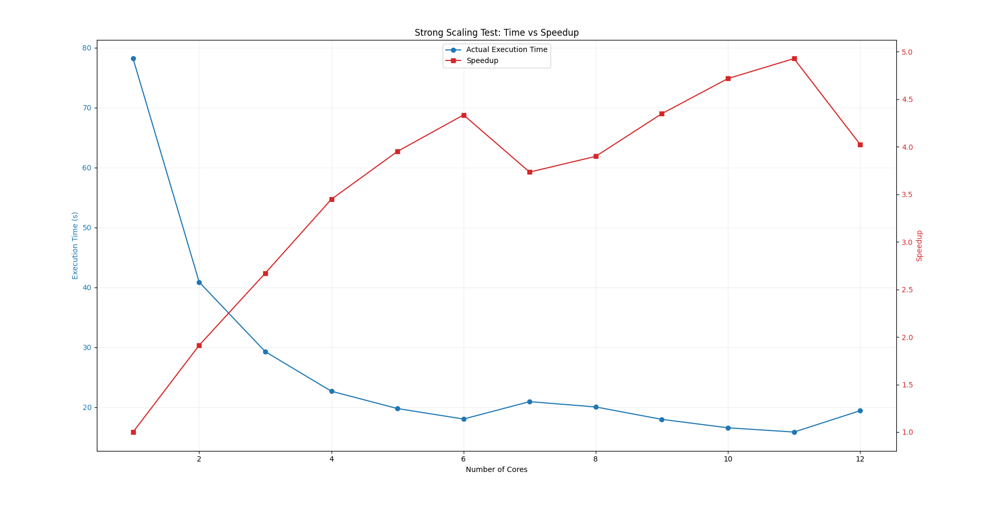

# lbm-simulation-lib

A header-only C++17 library for **Lattice Boltzmann Method (LBM)** fluid
simulations, with an OpenMP and a CUDA backend, 2D and 3D velocity sets,
pluggable collision operators and boundary conditions, and built-in error
estimation against analytical solutions and the Ghia et al. (1982) benchmark.

<!--toc:start-->
- [Introduction](#introduction)
  - [What the library is](#what-the-library-is)
  - [Physical and mathematical model](#physical-and-mathematical-model)
- [Properties and features](#properties-and-features)
- [Installation and configuration](#installation-and-configuration)
  - [Requirements](#requirements)
  - [Build](#build)
  - [CMake options](#cmake-options)
  - [Python tooling](#python-tooling)
- [Usage and simulation model](#usage-and-simulation-model)
  - [Anatomy of a simulation](#anatomy-of-a-simulation)
  - [Velocity sets](#velocity-sets)
  - [Boundary conditions](#boundary-conditions)
  - [Collision operators and stability](#collision-operators-and-stability)
  - [The time step algorithm](#the-time-step-algorithm)
  - [Configuration files](#configuration-files)
  - [Running a simulation](#running-a-simulation)
  - [Output files and visualization](#output-files-and-visualization)
- [Embedding the library in a CMake project](#embedding-the-library-in-a-cmake-project)
- [Design and performance](#design-and-performance)
  - [Architecture](#architecture)
  - [Parallelization strategy](#parallelization-strategy)
  - [Scaling results](#scaling-results)
- [Error estimation](#error-estimation)
  - [Against an analytical solution](#against-an-analytical-solution)
  - [Against the Ghia benchmark](#against-the-ghia-benchmark)
- [Documentation and report](#documentation-and-report)
- [References](#references)
- [License](#license)
- [Authors](#authors)
<!--toc:end-->

## Introduction

### What the library is

The Lattice Boltzmann equation describes the dynamics of a gas at the
*mesoscopic* scale; through a Chapman-Enskog expansion its solutions recover
the incompressible Navier-Stokes equations in the low-Mach limit. The
Boltzmann equation is analytically harder than the NSE, but its numerical
scheme is far simpler and highly local, which is why it is a popular choice
for CFD codes -- and an excellent target for parallelization.

`lbm-simulation-lib` grew out of an AMSC hands-on on the 2D lid-driven cavity
and was extended into a reusable simulation library:

- 2D **and** 3D problems (`D2Q9`, `D3Q19`, `D3Q27`);
- several collision operators (BGK, TRT; MRT is declared but not implemented);
- two execution backends (OpenMP, CUDA) behind a common solver interface;
- domain-face and immersed-obstacle boundary conditions;
- asynchronous output (raw binary, or a VTK series for ParaView);
- error estimation against analytical solutions and reference benchmarks.

The library itself is header-only (`include/lbm-sim/`); the executables under
`simulations/` are *examples* of how to drive it -- lid-driven cavity, Couette
flow, Poiseuille flow, flow past an obstacle.

### Physical and mathematical model

The method revolves around the *discrete-velocity distribution function*
$f_i(x,t)$, the particle *populations*. Discretized in velocity and time, the
lattice Boltzmann equation reads:

$$f_{i}(x + c_{i}\Delta{t}, t + \Delta{t}) = f_{i}(x,t) + \Omega_{i}(x,t)$$

where $c_i$ is the discrete velocity towards a neighbouring node and
$\Omega_i$ is the collision operator. With the Bhatnagar-Gross-Krook (BGK)
operator:

$$\Omega_{i}(f) = -\frac{f_{i}-f^{eq}_{i}}{\tau}\Delta{t}$$

and the equilibrium distribution (computed in `init_equilibrium` and in the
collision strategy):

$$f^{eq}_{i}(x,t) = w_{i}\rho\left(1 + \frac{u\cdot c_{i}}{c_{s}^2} + \frac{(u\cdot c_{i})^2}{2c^4_{s}} - \frac{u\cdot u}{2c^2_{s}}\right)$$

with $w_i$ the lattice weights, $\rho$ the density, $u$ the macroscopic
velocity and $c_s$ the lattice speed of sound ($c_s^2 = 1/3$ in lattice
units; the code stores $1/c_s^2 = 3$ as `lbm::numbers::invcs_2`).

## Properties and features

| Area | What is available |
|------|-------------------|
| Dimensions | 2D and 3D, selected by the `dim` template parameter (checked against the velocity set) |
| Velocity sets | `D2Q9`, `D3Q19`, `D3Q27` ([`core/velocity-sets.hpp`](include/lbm-sim/core/velocity-sets.hpp)) |
| Collision operators | `CollisionModel::BGK`, `CollisionModel::TRT` (`MRT` is reserved, currently a `static_assert`) |
| Backends | `ExecutionBackend::OPEN_MP` (`OpenMPSolver`), `ExecutionBackend::CUDA` (`CUDASolver`, opt-in at configure time) |
| Boundary conditions | Rigid-wall and moving-wall bounce-back, periodic, pressure-periodic inlet/outlet -- per domain face (`Solid::DomainBC`) or per immersed obstacle (`Solid::ObstacleData`) |
| Obstacles | Rasterized from analytic shapes: `Segment`, `Circle`, `Parallelogram`, `Airfoil` (2D) through `CollisionDetection::CollisionArea` |
| Output | `AsyncBinaryWriter` (raw binary, background thread) and `VtkWriter` (`.vti` frames + a `.pvd` series for ParaView) |
| Configuration | TOML files parsed with [toml++](https://github.com/marzer/tomlplusplus), validated against the binary's own dimension, operator and backend |
| Logging | [Quill](https://github.com/odygrd/quill), with a compile-time log level |
| Error estimation | `L1`, `L2`, `L2^2`, `Linf` norms against a user-supplied `analysis::Function<dim>`, or against the Ghia et al. tables |
| Post-processing | Python scripts for animations, velocity profiles, scaling plots and output validation |
| Documentation | Doxygen targets wired into the build |

## Installation and configuration

### Requirements

- **CMake** >= 3.18
- A **C++17** compiler with **OpenMP** support (GCC, Clang, or MSVC -- MSVC
  builds use `/openmp:experimental`)
- **Git** and network access at configure time: Quill (`v12.1.0`) and toml++
  (`v3.4.0`) are pulled in with `FetchContent`
- *Optional:* **CUDA Toolkit**, for the CUDA backend
- *Optional:* **Doxygen**, for the documentation targets
- *Optional:* **Python 3** with `numpy` and `matplotlib`, for post-processing

### Build

```bash
git clone https://github.com/Gab-San/lbm-simulation-lib.git
```

```bash
cmake -S . -B build && cmake --build build -j
```

Every `.cpp` under `simulations/` becomes an executable named after its file,
built into `build/simulations/`. With the CUDA backend enabled, every `.cu`
becomes an executable prefixed with `cuda_`:

```bash
cmake -S . -B build -DLBM_ENABLE_CUDA=ON -DCMAKE_CUDA_ARCHITECTURES=75 && cmake --build build -j
```

`CMAKE_CUDA_ARCHITECTURES` defaults to `75` -- set it to match your GPU. The
CUDA build deliberately aligns `CMAKE_CUDA_HOST_COMPILER` with
`CMAKE_CXX_COMPILER` (except under the Visual Studio generators), so that host
code compiled by `nvcc` and the rest of the project agree on one OpenMP
runtime.

### CMake options

| Option | Default | Meaning |
|--------|---------|---------|
| `LBM_ENABLE_CUDA` | `OFF` | Enable the CUDA language, build `lbm-sim-cuda` and the `cuda_*` executables |
| `CMAKE_CUDA_ARCHITECTURES` | `75` | Target GPU architecture(s) |
| `CMAKE_CUDA_HOST_COMPILER` | `CMAKE_CXX_COMPILER` | Host compiler driven by `nvcc`; override only for host compilers `nvcc` rejects |
| `LBM_LOG_LEVEL` | `INFO` | Compile-time Quill level: `TRACE_L3`, `TRACE_L2`, `TRACE_L1`, `DEBUG`, `INFO`, `WARNING`, `ERROR`, `CRITICAL` |

Log statements below `LBM_LOG_LEVEL` are compiled out entirely, so a release
run pays nothing for them:

```bash
cmake -S . -B build -DLBM_LOG_LEVEL=DEBUG
```

### Python tooling

```bash
python -m venv .venv && pip install -r scripts/requirements.txt
```

## Usage and simulation model

### Anatomy of a simulation

A simulation main is short and always follows the same steps. Condensed from
[`simulations/openmp/couette_d2q9_bgk.cpp`](simulations/openmp/couette_d2q9_bgk.cpp):

```cpp
using namespace lbm;
  using types::Coordinate;
  using types::DimPoint;
  using utils::Vector;

  // --- 1. LEGGI CONFIGURAZIONI --------------------------------------------
  if (argc < 2) {
    config::print_usage(argv[0]);
    return 1;
  }

  std::vector<config::SimulationConfig<DIM>> configs;
  try {
    configs = config::parse_config<DIM>(argv[1]);
    for (auto &cfg : configs)
      config::ensure_compatible(cfg, COLLISION, BACKEND);
  } catch (const config::ConfigError &err) {
    std::cerr << "Errore di configurazione: " << err.what() << "\n";
    return 1;
  }

  // --- 2. ISTANZIA LOGGER --------------------------------------------------
  logging::setup();
  logging::Logger *main_logger = logging::create_or_get_logger("main");

  // --- 3. ESEGUI UNA SIMULAZIONE PER OGNI CONFIG ---------------------------
  for (const auto &cfg : configs) {
    const DimPoint<DIM> grid_size(cfg.grid_size);

    LBM_LOG_INFO(
        main_logger,
        "Simulation '{}':\n\tGrid dimensions: {}\n\tReynolds number: "
        "{}\n\tInitial Velocity: {}\n\tNumber of Iterations: {}\n\tNumber "
        "of frames: {}\n\tFrames output: {}\n\tProfile output: {}",
        cfg.name, grid_size, cfg.reynolds, cfg.u0, cfg.niters, cfg.nframes,
        cfg.frames_out, cfg.profile_out);

    // --- 3. CREA OSTACOLI --------------------------------------------------
    // Couette: parete inferiore rigida, parete superiore mobile, lati sinistro
    // e destro periodici. Gli angoli restano alle orizzontali come prima: il
    // wrap su x avviene per primo, poi la faccia y rivendica il link.
    Solid::DomainBC<DIM> dbc{};
    dbc.low(0) = Solid::PERIODIC;        // x = 0
    dbc.high(0) = Solid::PERIODIC;       // x = nx-1
    dbc.low(1) = Solid::BB_RIGID_WALL;   // y = 0
    dbc.high(1) = Solid::BB_MOVING_WALL; // y = ny-1

    // --- 4. CREA MASCHERA --------------------------------------------------
    // Nessun ostacolo immerso nel fluido: la maschera e' tutta types::FLUID.
    types::solid_mask_t solid_mask =
        Solid::compute_solid_mask<DIM>({}, grid_size);

    // --- 5. LANCIA SIMULAZIONE ---------------------------------------------
    // frames_out e' la CARTELLA; il basename dei file lo da' il nome della
    // configurazione, cosi' run diversi nella stessa cartella non si
    // sovrascrivono a vicenda.
    std::shared_ptr<AsyncBinaryWriter> writer =
        std::make_shared<AsyncBinaryWriter>(cfg.frames_out);

    LBMSimulation<DIM, D2Q9, COLLISION> simulation(
        grid_size, std::move(solid_mask), {}, dbc,
        CollisionParams<DIM, COLLISION>(cfg.reynolds, grid_size, cfg.u0));
    simulation.attachListener(writer);

    OpenMPSolver<DIM, D2Q9, COLLISION> solver(cfg.niters, cfg.nframes);
    solver.attachListener(writer);

    simulation.solve(solver);

    simulation.output(cfg.profile_out.c_str(),
                      functional::extract_dx_profile_along_y_center);

// 7. Error estimation (see the dedicated section)
  }
```

The writer must be attached to **both** objects: `LBMSimulation` emits the
grid-size header, the solver emits the velocity-norm frames, and they are two
distinct `DataObservable`s.

Moving to 3D means changing three things: `DIM`, the velocity set (`D3Q19` or
`D3Q27`) and the profile extractor
(`functional::extract_dx_profile_along_z_center`). See
[`lid_cavity_d3q19_bgk.cpp`](simulations/openmp/lid_cavity_d3q19_bgk.cpp).

### Velocity sets

Each velocity set is a compile-time struct exposing `dim`, `ndir`, the weights
`wi[]`, the discrete directions `dir[]` and the opposite-direction table
`opp[]`. `D2Q9` uses the following numbering:

```
------ +x
|7 4 8
|3 0 1
|6 2 5
+y
```

| i | c_i | Meaning | w_i |
|--:|:---:|---------|-----|
| 0 | ( 0, 0) | rest | 4/9 |
| 1 | (+1, 0) | east | 1/9 |
| 2 | ( 0,+1) | north | 1/9 |
| 3 | (-1, 0) | west | 1/9 |
| 4 | ( 0,-1) | south | 1/9 |
| 5 | (+1,+1) | north-east | 1/36 |
| 6 | (-1,+1) | north-west | 1/36 |
| 7 | (-1,-1) | south-west | 1/36 |
| 8 | (+1,-1) | south-east | 1/36 |

`D3Q19` (rest, 6 face and 12 edge neighbours; weights 1/3, 1/18, 1/36) is the
usual compromise for 3D cavities; `D3Q27` adds the 8 vertex neighbours for
better isotropy at a higher per-node cost. Rendered direction diagrams live in
[`docs/assets/`](docs/assets).

### Boundary conditions

Boundaries come in two flavours, and neither costs anything proportional to
the resolution:

- **Domain faces** -- `Solid::DomainBC<dim>` holds one `boundary_t` per face
  (4 bytes in 2D, 6 in 3D), set through `low(axis)` and `high(axis)`.
  Available values: `NONE`, `BB_RIGID_WALL`, `BB_MOVING_WALL`, `PERIODIC`,
  `PRESSURE_PERIODIC_INLET`, `PRESSURE_PERIODIC_OUTLET`. A periodic axis must
  wrap on both faces (`assert_consistent_domain_bc`).
- **Immersed obstacles** -- analytic shapes are rasterized into a
  `types::solid_mask_t` (one 16-bit obstacle id per node, `types::FLUID`
  elsewhere) by `Solid::compute_solid_mask`, and a side table of
  `Solid::ObstacleData<dim>` maps each id to its BC type and wall velocity.

No-slip walls are enforced with bounce-back: incoming populations are
reflected into their opposite directions (`VelocitySet::opp`). A moving wall
uses the same scheme plus the momentum correction that imposes the prescribed
wall velocity -- that is how the cavity lid is driven.

### Collision operators and stability

`CollisionParams<dim, cm_t>` derives the relaxation parameters from the
Reynolds number, the grid and the characteristic velocity:

$$\nu = \frac{u_0 \, N_y}{Re}, \qquad \tau = 3\nu + \tfrac{1}{2}$$

BGK stores the inverse relaxation time as $1/\tau = 2/(6\nu+1)$; TRT stores
the symmetric and antisymmetric pair $\tau^+ = 3\nu + 1/2$ and
$\tau^- = 1/2 + \frac{1/4}{\tau^+ - 1/2}$.

The constructor **throws** when $\tau \le 0.5$ and warns when $\tau$ falls
outside $[0.55, 1.2]$, where BGK becomes fragile. In practice:

- high-Reynolds runs need enough grid resolution;
- the lid velocity must stay small in lattice units (low Mach number);
- density fluctuations must stay small -- the macroscopic velocity is obtained
  by dividing momentum by $\rho$, so a collapsing density makes $u$ explode.

`u0.dx` must be strictly positive even for problems where no wall moves
(Poiseuille), because it is the characteristic velocity behind $\nu$.

### The time step algorithm

Each iteration of `OpenMPSolver::solve` performs:

1. streaming, with boundary conditions resolved link by link;
2. computation of the macroscopic moments $\rho(x,t)$ and $u(x,t)$;
3. computation of the equilibrium $f^{eq}_i(x,t)$;
4. collision;
5. every `niters / nframes` steps, emission of a velocity-norm frame to the
   attached listeners.

Steps 1-4 are fused into a single `update_stream_collide` pass over two
population buffers that are swapped at the end of the step, so populations are
read from one array and written to the other with no aliasing and no extra
copy. The macroscopic fields are materialized only on the steps that need them
(a frame step, or the last iteration).

### Configuration files

Configurations are TOML files holding an array of `[[conf]]` tables -- one run
each -- parsed by `lbm::config::parse_config<dim>()`:

```toml
[[conf]]
collision = "BGK"        # BGK | TRT | MRT
backend   = "openmp"     # openmp | cuda

[conf.lattice]
size = [129, 129]        # length must match the binary's dimension

[conf.physics]
reynolds = 100.0
size     = [0.1, 0.0]    # initial/characteristic velocity, size[0] > 0

[conf.solver]
niters  = 100000
nframes = 200            # must not exceed niters

[conf.output]
frames  = "output/lid_cavity_frames"
profile = "output/lid_cavity_profile.dat"
```

Every field is mandatory except `collision` and `backend`, which default to
`BGK` and `openmp`, and `nframes`, which defaults to `0` (no frames written).
Failures raise `config::ConfigError` with a message naming
the offending field, so a main can distinguish a bad configuration (print,
exit 1) from an error raised during the solve. After parsing,
`config::ensure_compatible(cfg, COLLISION, BACKEND)` rejects a file whose
operator or backend does not match the binary reading it, instead of silently
ignoring it.

### Running a simulation


```bash
./build/simulations/couette_flow_2d_bgk configs/couette.toml
```

The first is the common case:
`couette_flow_2d_bgk` is currently the only one that reads a `.toml` from the
command line.

Benchmark tables and the `configs/` directory are passed to the executables as
absolute paths at configure time (`LBM_BENCHMARKS_DIR`, `LBM_CONFIGS_DIR`), so
a binary finds its input data from any working directory and editing a `.toml`
takes effect without recompiling. Output paths, on the other hand, are relative
to the working directory: run from the repository root to get output under
`output/`.

The CUDA executables can be run in sequence, with one log per run, by:

```bash
./run_cuda_simulations.sh
```

```bash
./run_cuda_simulations.sh lid_cavity_2d_bgk
```

With no arguments it runs every `cuda_*` executable found in
`build/simulations`; `BIN_DIR` and `LOG_DIR` override the defaults.

### Output files and visualization

There are two output products, both written off the simulation thread:

- **Frames** -- the velocity magnitude at every node, emitted every
  `niters / nframes` steps. `AsyncBinaryWriter` writes them as a raw binary
  stream (`nx`, `ny` [, `nz`] as `int32`, then one `float32` per node per
  frame); `VtkWriter` turns the same stream into one `.vti` file per frame plus
  a `.pvd` series that ParaView can open *while the run is still going*.
- **Profile** -- a 1D velocity profile along a centerline, written by
  `LBMSimulation::output()` with an extractor from `lbm::functional`. The file
  starts with a `%%profile <operator> <n> <u_ref>` ASCII header, followed by
  `float64` samples.

```bash
python scripts/visualize_frames.py out/norms_lid_cavity.bin -o cavity.gif
```

```bash
python scripts/visualize_profile.py output/lid_cavity_bgk_profile.dat benchmarks/ghia/data_y_100.txt --title "Re = 100" -o profile.png
```

```bash
python scripts/validate_outputs.py
```

`visualize_frames.py` animates the raw binary frames, `visualize_profile.py`
overlays one or more profiles (including the Ghia tables, which are already
normalized by the lid velocity), and `validate_outputs.py` checks the produced
files structurally and numerically -- headers, payload lengths, finite values,
and duplicate output paths declared by different CUDA sources.

<p align="center">
  
  
</p>

## Embedding the library in a CMake project

`lbm-sim` is an `INTERFACE` (header-only) target that already carries its
include directory, OpenMP, the logging helper and toml++. The top-level
`CMakeLists.txt` adds `simulations/` only when the project is top level, so
consuming it as a subproject builds the library and nothing else.

With `FetchContent`:

```cmake
include(FetchContent)
FetchContent_Declare(
  lbm-simulation-lib
  GIT_REPOSITORY https://github.com/Gab-San/lbm-simulation-lib.git
  GIT_TAG        main
)
FetchContent_MakeAvailable(lbm-simulation-lib)

add_executable(my_sim my_sim.cpp)
target_link_libraries(my_sim PRIVATE lbm-sim)
```

Or with a vendored copy:

```cmake
add_subdirectory(external/lbm-simulation-lib)
target_link_libraries(my_sim PRIVATE lbm-sim)
```

For the CUDA backend, configure the consuming project with
`-DLBM_ENABLE_CUDA=ON` and link `lbm-sim-cuda` instead: it pulls `lbm-sim` in
and adds relocatable device code plus the OpenMP flag for `nvcc`'s host pass.

## Design and performance

### Architecture

The library is built around compile-time polymorphism, so that the dimension,
the velocity set and the collision operator cost nothing at run time:

```
LBMSimulation<dim, VelocitySet, CollisionModel>   owns the Lattice + CollisionParams
        |  solve(solver)
        v
SolverBase<dim, VelocitySet, CollisionModel, Backend>
        |-- OpenMPSolver<dim, VelocitySet, cm>
        `-- CUDASolver<dim, VelocitySet, cm>
                 uses CollisionStrategy<dim, VelocitySet, cm>   (BGK / TRT)

DataObservable ---notify---> IDataListener
        ^                        |-- AsyncBinaryWriter
        |-- LBMSimulation        `-- VtkWriter
        `-- SolverBase
```

Three deliberate choices shape the code:

- **Strategy for collision.** `CollisionStrategy` dispatches on the
  `CollisionModel` template parameter with `if constexpr`, so the collision
  kernel is inlined into the fused stream-collide loop; an unimplemented
  operator is a compile error, not a run-time branch.
- **Observer for output.** Solvers know nothing about file formats: they push
  raw byte chunks to listeners. Both writers drain a queue on a dedicated
  thread, so disk I/O overlaps with computation and the format can change
  without touching the solver.
- **O(1) boundary description.** Domain faces are at most six bytes regardless
  of resolution, and the per-node solid mask is 2 bytes per node -- about 1.4%
  of the population arrays on a 1000^2 grid, which keeps obstacle support
  essentially free.

A UML view of the project lives in
[`docs/project_structure/LBM_UML.html`](docs/project_structure/LBM_UML.html)
(editable source: `LBM_UML.drawio`).

### Parallelization strategy

LBM parallelizes well because its operations are local: at each time step
almost every computation touches a single node and its immediate neighbours.
The collision step is *purely* local, and the macroscopic moments at a node
depend only on the populations stored there, so the node loop is embarrassingly
parallel:

```cpp
#pragma omp parallel for shared(lattice, part_stream) schedule(runtime)
for (int cell = 0; cell < area; cell++) { /* ... */ }
```

The loops iterate over a flattened cell index and recover the coordinate with
`iteration::unflatten`, which keeps one `parallel for` for both 2D and 3D
instead of a `collapse(2)` / `collapse(3)` pair. `schedule(runtime)` leaves the
schedule to `OMP_SCHEDULE`, so a scaling study can vary it without rebuilding:

```bash
OMP_NUM_THREADS=8 OMP_SCHEDULE=static ./build/simulations/lid_cavity_d2q9_bgk
```

The CUDA backend maps the same node loop onto the device, with the velocity set
uploaded to `__constant__` memory and the domain BC passed by value as a kernel
argument (`DomainBC` is trivially copyable by design).

### Scaling results

Strong scaling -- 129x129 grid, `Re = 100`, 10 000 steps (red: speedup, blue:
wall time in seconds):



Weak scaling -- problem size grown with the thread count (blue: wall time in
seconds), over 50^2 and 100^2 at `Re = 100`, 150^2 and 200^2 at `Re = 500`,
250^2 and 300^2 at `Re = 1000`:


> These plots were produced with `scripts/strong_scaling.py` and
> `scripts/weak_scaling.py` for the 2D OpenMP solver of the original hands-on.
> Both scripts still emit the old flat configuration format and need updating
> before they can drive the current binaries.

## Error estimation

Two complementary facilities, both reachable from `LBMSimulation`.

### Against an analytical solution

Modelled on `dealii::VectorTools`: pass an exact solution and a norm type; the
discrete field and the grid are taken from the simulation itself.

```cpp
const analysis::PoiseuilleSolution2D exact(channel_height, u_max);
const double err = simulation.compute_error(analysis::NormType::L2, exact);
```

`analysis::NormType` covers `L1`, `L2`, `L2_squared` and `Linfty`.
`ErrorEvaluator<dim>::integrate_difference()` produces the per-cell error and
`compute_global_error()` reduces it in the requested norm; `compute_error()`
returns the **absolute** global error. Ready-made solutions are
`analysis::CouetteSolution2D` and `analysis::PoiseuilleSolution2D`; any other
case is a subclass of `analysis::Function<dim>` overriding
`value(const Coordinate<dim> &)`.

### Against the Ghia benchmark

For the 2D lid-driven cavity, results are validated against Ghia, Ghia & Shin
(1982). The tables in [`benchmarks/ghia/`](benchmarks/ghia) hold the reference
centerline profiles for `Re = 100`, `1000` and `7500`, already normalized by
the lid velocity.

```cpp
const auto ghia_y = simulation.compute_ghia_error("benchmarks/ghia/data_y_100.txt");
// ghia_y.relative, ghia_y.absolute, ghia_y.norm_type
```

`compute_ghia_error()` compares `lattice.u` along the two centerlines with the
tabulated points, reduces them to a scalar in the requested norm (`L2` by
default) and returns both the absolute and the relative error in an
`analysis::NormErrorResult`. It is defined **only for `dim == 2`** -- the 3D
cavity has no tabulated equivalent here, so 3D runs are validated by exporting
the centerline profile and comparing it against external reference data.

<p align="center">
  
  
</p>

## Documentation and report

API documentation is generated with Doxygen when it is found at configure
time:

```bash
cmake --build build --target lbm-docs-full
```

- `lbm-sim-docs` -- the library headers alone;
- `lbm-docs-full` -- the whole portal, using
  [`docs/mainpage.md`](docs/mainpage.md) as the main page.

Output lands in `docs/doxygen/`.

Reference material used throughout the project is collected in
[`docs/references/`](docs/references) (the assignment proposal and the Ghia et
al. paper), and the task breakdown in
[`docs/project_structure/project_subdivision.md`](docs/project_structure/project_subdivision.md).

<!-- TODO: link the final project report here once it is published. -->
**Project report:** _to be linked._

## References

- T. Kruger et al., *The Lattice Boltzmann Method: Principles and Practice*,
  Graduate Texts in Physics, Springer, 2017.
- U. Ghia, K. N. Ghia, C. T. Shin, *High-Re solutions for incompressible flow
  using the Navier-Stokes equations and a multigrid method*, Journal of
  Computational Physics 48 (1982) 387-411.

## License

Released under the [MIT License](LICENSE). Copyright (c) 2026 Gabriele
Santandrea.

## Authors

[Alessandro Frisone](https://github.com/DatemiUn30L) |
[Corrado Sciancalepore](https://github.com/CorradoSciancalepore) |
[Chiara Nonino](https://github.com/ChiaraNonino) |
[Gabriele Santandrea](https://github.com/Gab-San)
