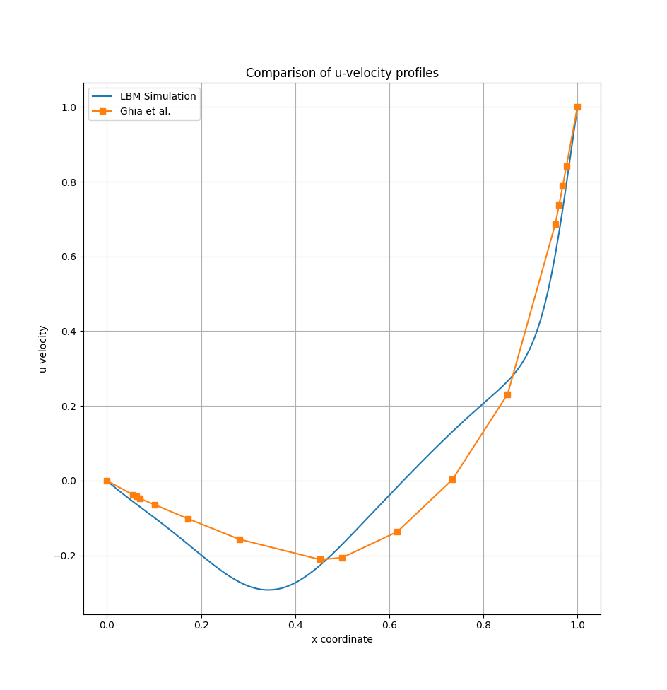
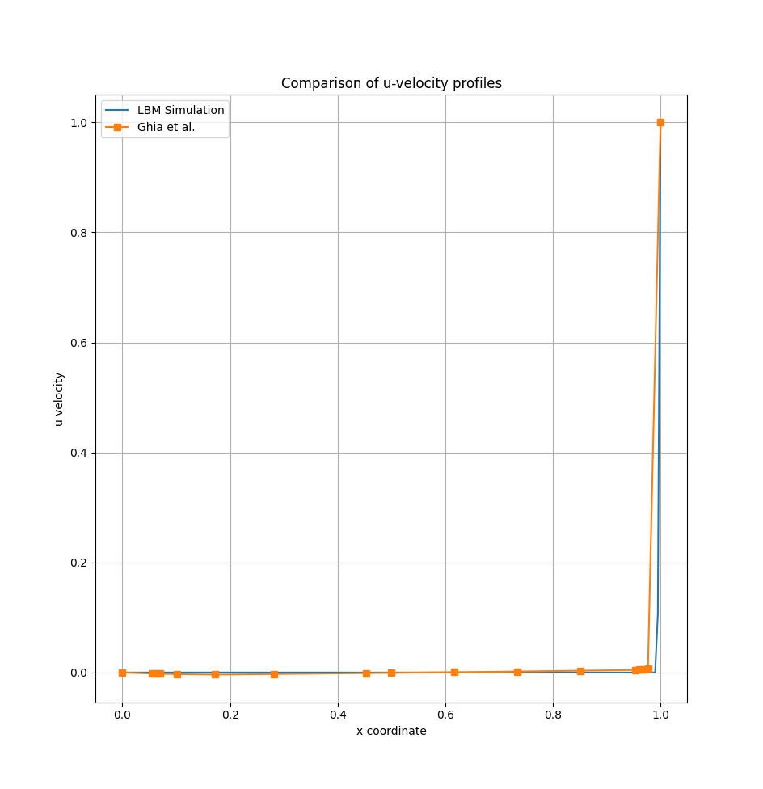

# lbm-simulation-lib

A header-only C++17 library for **Lattice Boltzmann Method (LBM)** fluid
simulations, with an OpenMP and a CUDA backend, 2D and 3D velocity sets,
pluggable collision operators and boundary conditions, and built-in error
estimation against analytical solutions and the Ghia et al. (1982) benchmark.

<!--toc:start-->
- [Introduction](#introduction)
  - [What the library is](#what-the-library-is)
- [Properties and features](#properties-and-features)
- [Installation and configuration](#installation-and-configuration)
  - [Requirements](#requirements)
  - [Build](#build)
  - [CMake options](#cmake-options)
  - [Python tooling](#python-tooling)
- [Usage and simulation model](#usage-and-simulation-model)
  - [Anatomy of a simulation](#anatomy-of-a-simulation)
  - [Configuration files](#configuration-files)
  - [Running a simulation](#running-a-simulation)
- [Architecture](#architecture)
  - [Velocity sets](#velocity-sets)
  - [Boundary conditions](#boundary-conditions)
  - [The time step algorithm](#the-time-step-algorithm)
  - [Parallelization strategy](#parallelization-strategy)
- [Error estimation](#error-estimation)
  - [Against an analytical solution](#against-an-analytical-solution)
  - [Against the Ghia benchmark](#against-the-ghia-benchmark)
- [Documentation and report](#documentation-and-report)
- [References](#references)
- [License](#license)
- [Authors](#authors)
<!--toc:end-->

## Introduction

### What the library is

The Lattice Boltzmann equation describes the dynamics of a gas at the
*mesoscopic* scale; through a Chapman-Enskog expansion its solutions recover
the incompressible Navier-Stokes equations in the low-Mach limit. The
Boltzmann equation is analytically harder than the NSE, but its numerical
scheme is far simpler and highly local, which is why it is a popular choice
for CFD codes -- and an excellent target for parallelization.

`lbm-simulation-lib` grew out of an AMSC hands-on on the 2D lid-driven cavity
and was extended into a reusable simulation library:

- 2D **and** 3D problems (`D2Q9`, `D3Q19`, `D3Q27`);
- several collision operators (BGK, TRT);
- two execution backends (OpenMP, CUDA) behind a common solver interface;
- domain-face and immersed-obstacle boundary conditions;
- asynchronous output (raw binary, or a VTK series for ParaView);
- error estimation against analytical solutions and reference benchmarks.

The library itself is header-only (`include/lbm-sim/`); the executables under
`simulations/` are *examples* of how to drive it -- lid-driven cavity, Couette
flow, Poiseuille flow, flow past an obstacle.

## Properties and features

| Area | What is available |
|------|-------------------|
| Dimensions | 2D and 3D, selected by the `dim` template parameter (checked against the velocity set) |
| Velocity sets | `D2Q9`, `D3Q19`, `D3Q27` ([`core/velocity-sets.hpp`](include/lbm-sim/core/velocity-sets.hpp)) |
| Collision operators | `CollisionModel::BGK`, `CollisionModel::TRT` (`MRT` is reserved, currently a `static_assert`) |
| Backends | `ExecutionBackend::OPEN_MP` (`OpenMPSolver`), `ExecutionBackend::CUDA` (`CUDASolver`, opt-in at configure time) |
| Boundary conditions | Rigid-wall and moving-wall bounce-back, periodic, pressure-periodic inlet/outlet -- per domain face (`Solid::DomainBC`) or per immersed obstacle (`Solid::ObstacleData`) |
| Obstacles | Rasterized from analytic shapes: `Segment`, `Circle`, `Parallelogram`, `Airfoil` (2D only), `CylindricalShell` (3D only) through `CollisionDetection::CollisionArea` |
| Output | `AsyncBinaryWriter` (raw binary, background thread) and `VtkWriter` (`.vti` frames + a `.pvd` series for ParaView) |
| Configuration | TOML files parsed with [toml++](https://github.com/marzer/tomlplusplus), validated against the binary's own dimension, operator and backend |
| Logging | Three interchangeable backends selected by `LBM_LOG_BACKEND`: [Quill](https://github.com/odygrd/quill), `ostream` (no dependency), or `none` (macros expand away); the active level is fixed at compile time |
| Profiling | Optional chrono instrumentation (`LBM_ENABLE_PROFILING`), dumped as CSV next to the profile output |
| Error estimation | `L1`, `L2`, `L2^2`, `Linf` norms against a user-supplied `analysis::Function<dim>`, or against the Ghia et al. tables |
| Post-processing | Python scripts for animations, velocity profiles, scaling plots and output validation |
| Documentation | Doxygen targets wired into the build |

## Installation and configuration

### Requirements

- **CMake** >= 3.18
- A **C++17** compiler with **OpenMP** support (GCC, Clang, or MSVC -- MSVC
  builds use `/openmp:experimental`)
- **Git** and network access at configure time, unless both optional
  dependencies are disabled: Quill (`v12.1.0`) is fetched only when
  `LBM_LOG_BACKEND=quill` (the default) and toml++ (`v3.4.0`) only when
  `LBM_ENABLE_CONFIG=ON` (the default)
- *Optional:* **CUDA Toolkit**, for the CUDA backend
- *Optional:* **Doxygen**, for the documentation targets
- *Optional:* **Python 3** with `numpy` and `matplotlib`, for post-processing

### Build

```bash
git clone https://github.com/Gab-San/lbm-simulation-lib.git
```

```bash
cmake -S . -B build && cmake --build build -j
```

Every `.cpp` under `simulations/` becomes an executable named after its file,
built into `build/simulations/`. With the CUDA backend enabled, every `.cu`
becomes an executable prefixed with `cuda_`:

```bash
cmake -S . -B build -DLBM_ENABLE_CUDA=ON -DCMAKE_CUDA_ARCHITECTURES=75 && cmake --build build -j
```

`CMAKE_CUDA_ARCHITECTURES` defaults to `75` -- set it to match your GPU. The
CUDA build deliberately aligns `CMAKE_CUDA_HOST_COMPILER` with
`CMAKE_CXX_COMPILER` (except under the Visual Studio generators), so that host
code compiled by `nvcc` and the rest of the project agree on one OpenMP
runtime.

### CMake options

| Option | Default | Meaning |
|--------|---------|---------|
| `LBM_ENABLE_CUDA` | `OFF` | Enable the CUDA language, build `lbm-sim-cuda` and the `cuda_*` executables |
| `LBM_ENABLE_CONFIG` | `ON` | Build the TOML configuration support (fetches toml++) |
| `LBM_ENABLE_PROFILING` | `OFF` | Compile the chrono-based profiling instrumentation (`LBM_PROFILING`) |
| `LBM_ENABLE_LOGGING` | `ON` | Emit log output; `OFF` forces `LBM_LOG_BACKEND=none` |
| `LBM_LOG_BACKEND` | `quill` | Logging backend: `quill` (fetched), `ostream` (no dependency), `none` |
| `LBM_LOG_LEVEL` | `INFO` | Compile-time active level: `TRACE_L3`, `TRACE_L2`, `TRACE_L1`, `DEBUG`, `INFO`, `WARNING`, `ERROR`, `CRITICAL` |
| `LBM_BUILD_SIMULATIONS` | top-level | Build the executables under `simulations/`; off by default when the project is embedded |
| `LBM_BUILD_DOCS` | top-level | Configure the `docs/` Doxygen targets; off by default when the project is embedded |
| `LBM_SANITIZE` | *(empty)* | Sanitizers to build with: `address`, `undefined`, `thread`, `leak` (comma- or semicolon-separated) |
| `CMAKE_CUDA_ARCHITECTURES` | `75` | Target GPU architecture(s) |
| `CMAKE_CUDA_HOST_COMPILER` | `CMAKE_CXX_COMPILER` | Host compiler driven by `nvcc`; override only for host compilers `nvcc` rejects |

Log statements below `LBM_LOG_LEVEL` are compiled out entirely, so a release
run pays nothing for them:

```bash
cmake -S . -B build -DLBM_LOG_LEVEL=DEBUG
```

### Python tooling

```bash
python -m venv .venv && pip install -r scripts/py/requirements.txt
```

## Usage and simulation model

### Anatomy of a simulation

A simulation main is short and always follows the same steps. Condensed from
[`simulations/openmp/couette_d2q9_bgk.cpp`](simulations/openmp/couette_d2q9_bgk.cpp):

```cpp
using namespace lbm;
using types::DimPoint;

// --- 1. READ THE CONFIGURATION FILE --------------------------------------
if (argc < 2) {
  config::print_usage(argv[0]);
  return 1;
}

// --- 2. SET UP THE LOGGER ------------------------------------------------
logging::setup();
logging::Logger *main_logger = logging::create_or_get_logger("main");

std::vector<config::SimulationConfig<DIM>> configs;
try {
  configs = config::parse_config<DIM>(argv[1]);
} catch (const config::ConfigError &err) {
  LBM_LOG_ERROR(main_logger, "Config Error {}", err.what());
  return 1;
}

// --- 3. RUN ONE SIMULATION PER CONFIGURATION -----------------------------
for (const auto &cfg : configs) {
  const DimPoint<DIM> grid_size(cfg.grid_size);
  utils::Vector<double, DIM> u0(cfg.u0);

  // --- 4. DESCRIBE THE DOMAIN FACES --------------------------------------
  // Couette: rigid bottom wall, moving top wall, periodic left and right
  // sides. Corners still belong to the horizontal faces: the wrap on x
  // happens first, then the y face claims the link.
  Solid::DomainBC<DIM> dbc{};
  dbc.low(0) = Solid::PERIODIC;        // x = 0
  dbc.high(0) = Solid::PERIODIC;       // x = nx-1
  dbc.low(1) = Solid::BB_RIGID_WALL;   // y = 0
  dbc.high(1) = Solid::BB_MOVING_WALL; // y = ny-1

  // --- 5. BUILD THE SOLID MASK -------------------------------------------
  // No obstacle immersed in the fluid: the mask is entirely types::FLUID.
  types::solid_mask_t solid_mask =
      Solid::compute_solid_mask<DIM>({}, grid_size);

  // --- 6. RUN THE SIMULATION ---------------------------------------------
  // frames_out is the DIRECTORY; the file basename comes from the config
  // name, so different runs in the same directory do not overwrite each
  // other.
  std::shared_ptr<AsyncBinaryWriter> writer =
      std::make_shared<AsyncBinaryWriter>(cfg.frames_out);

  LBMSimulation<DIM, D2Q9, COLLISION> simulation(
      grid_size, std::move(solid_mask), {}, dbc,
      CollisionParams<DIM, COLLISION>(cfg.reynolds, grid_size, u0));
  simulation.attachListener(writer);

  OpenMPSolver<DIM, D2Q9, COLLISION> solver(cfg.niters, cfg.nframes);
  solver.attachListener(writer);

  simulation.solve(solver);

  simulation.output(cfg.profile_out.c_str(),
                    functional::extract_dx_profile_along_y_center);

  // --- 7. ESTIMATE THE ERROR (see the dedicated section) -----------------
  const double H = static_cast<double>(grid_size.y - 1);
  const auto exact_solution = analysis::CouetteSolution2D(H, u0.dx);
  const double err_l2 =
      simulation.compute_error(analysis::NormType::L2, exact_solution);
  LBM_LOG_NOTICE(main_logger, "{} error: {}",
                 analysis::to_string(analysis::NormType::L2), err_l2);

  simulation.detachListener(writer);
  solver.detachListener(writer);
}
```

The writer must be attached to **both** objects: `LBMSimulation` emits the
grid-size header, the solver emits the velocity-norm frames, and they are two
distinct `DataObservable`s. Detach it from both at the end of a run, so the
next configuration in the loop starts from a clean listener list.

Moving to 3D means changing three things: `DIM`, the velocity set (`D3Q19` or
`D3Q27`) and the profile extractor
(`functional::extract_dx_profile_along_z_center`). See
[`lid_cavity_d3q19_bgk.cpp`](simulations/openmp/lid_cavity_d3q19_bgk.cpp).

### Configuration files

Configurations are TOML files holding an array of `[[conf]]` tables -- one run
each -- parsed by `lbm::config::parse_config<dim>()`, which returns a
`std::vector<config::SimulationConfig<dim>>`:

```toml
[[conf]]

[conf.lattice]
size = [129, 129]          # [nx, ny] in 2D, [nx, ny, nz] in 3D

[conf.physics]
reynolds = 100.0           # > 0
size     = [0.1, 0.0]      # reference velocity; size[0] must be > 0

[conf.solver]
niters  = 100000           # > 0
nframes = 200              # must not exceed niters

[conf.output]
frames  = "out/frames.out"
profile = "out/profile.dat"

[conf.backend]
n_threads = 8              # optional; 0 means "let the backend decide"
```

Every field is mandatory except `nframes` and `n_threads`, which both default
to `0`. The dimension, the collision operator and the backend are **not**
fields: they are compile-time parameters of the binary, so a `lattice.size` of
the wrong length is rejected instead of being reinterpreted. Failures raise
`config::ConfigError` with a message naming the offending field, so a main can
distinguish a bad configuration (print, exit 1) from an error raised during the
solve. Repeat the `[[conf]]` block to describe several runs in one file --
`configs/profiling.toml` is a thread-count sweep written that way.

### Running a simulation

Every executable under `simulations/` takes the path of a `.toml` as its only
argument, and prints a usage line when called without one:

```bash
./build/simulations/couette_d2q9_bgk configs/example.toml
```

```bash
./build/simulations/cuda_lid_cavity_d2q9_bgk configs/lid_cavity_cuda.toml
```

The two `obstacle_flow_2d_bgk` mains are the exception: their geometry is
hardcoded, so they take no configuration file.

Benchmark tables and the `configs/` directory are passed to the executables as
absolute paths at configure time (`LBM_BENCHMARKS_DIR`, `LBM_CONFIGS_DIR`), so
a binary finds its input data from any working directory and editing a `.toml`
takes effect without recompiling. Output paths, on the other hand, are relative
to the working directory, and the files under `configs/` write to `out/...`:
launch from `build/simulations/` to collect the output under
`build/simulations/out/`, or point `[conf.output]` somewhere else.

The CUDA executables can be run in sequence, one log per run, with:

```bash
./run_cuda_simulations.sh
```

```bash
./run_cuda_simulations.sh lid_cavity_d2q9_bgk
```

With no argument it runs every `cuda_*` executable found in
`build/simulations`; a name is accepted with or without the `cuda_` prefix, and
`BIN_DIR` and `LOG_DIR` override the defaults.

## Architecture

The library is built around compile-time polymorphism, so that the dimension,
the velocity set and the collision operator cost nothing at run time:

```
LBMSimulation<dim, VelocitySet, CollisionModel>   owns the Lattice + CollisionParams
        |  solve(solver)
        v
SolverBase<dim, VelocitySet, CollisionModel, Backend>
        |-- OpenMPSolver<dim, VelocitySet, cm>
        `-- CUDASolver<dim, VelocitySet, cm>
                 uses CollisionStrategy<dim, VelocitySet, cm>   (BGK / TRT)

DataObservable ---notify---> IDataListener
        ^                        |-- AsyncBinaryWriter
        |-- LBMSimulation        `-- VtkWriter
        `-- SolverBase
```

Three deliberate choices shape the code:

- **Strategy for collision.** `CollisionStrategy` dispatches on the
  `CollisionModel` template parameter with `if constexpr`, so the collision
  kernel is inlined into the fused stream-collide loop; an unimplemented
  operator is a compile error, not a run-time branch.
- **Observer for output.** Solvers know nothing about file formats: they push
  raw byte chunks to listeners. Both writers drain a queue on a dedicated
  thread, so disk I/O overlaps with computation and the format can change
  without touching the solver.
- **O(1) boundary description.** Domain faces are at most six bytes regardless
  of resolution, and the per-node solid mask is 2 bytes per node -- about 1.4%
  of the population arrays on a 1000^2 grid, which keeps obstacle support
  essentially free.

A UML view of the project lives in
[`docs/report/LBM_UML.html`](docs/report/LBM_UML.html)
(editable source: `LBM_UML.drawio`).

### Velocity sets

Each velocity set is a compile-time struct exposing `dim`, `ndir`, the weights
`wi[]`, the discrete directions `dir[]` and the opposite-direction table
`opp[]`. `D2Q9` uses the following numbering:

```
------ +x
|7 4 8
|3 0 1
|6 2 5
+y
```

| i | c_i | Meaning | w_i |
|--:|:---:|---------|-----|
| 0 | ( 0, 0) | rest | 4/9 |
| 1 | (+1, 0) | east | 1/9 |
| 2 | ( 0,+1) | north | 1/9 |
| 3 | (-1, 0) | west | 1/9 |
| 4 | ( 0,-1) | south | 1/9 |
| 5 | (+1,+1) | north-east | 1/36 |
| 6 | (-1,+1) | north-west | 1/36 |
| 7 | (-1,-1) | south-west | 1/36 |
| 8 | (+1,-1) | south-east | 1/36 |

`D3Q19` (rest, 6 face and 12 edge neighbours; weights 1/3, 1/18, 1/36) is the
usual compromise for 3D cavities; `D3Q27` adds the 8 vertex neighbours for
better isotropy at a higher per-node cost. Rendered direction diagrams live in
[`docs/assets/`](docs/assets).

### Boundary conditions

Boundaries come in two flavours, and neither costs anything proportional to
the resolution:

- **Domain faces** -- `Solid::DomainBC<dim>` holds one `boundary_t` per face
  (4 bytes in 2D, 6 in 3D), set through `low(axis)` and `high(axis)`.
  Available values: `NONE`, `BB_RIGID_WALL`, `BB_MOVING_WALL`, `PERIODIC`,
  `PRESSURE_PERIODIC_INLET`, `PRESSURE_PERIODIC_OUTLET`. A periodic axis must
  wrap on both faces (`assert_consistent_domain_bc`).
- **Immersed obstacles** -- analytic shapes are rasterized into a
  `types::solid_mask_t` (one 16-bit obstacle id per node, `types::FLUID`
  elsewhere) by `Solid::compute_solid_mask`, and a side table of
  `Solid::ObstacleData<dim>` maps each id to its BC type and wall velocity.

No-slip walls are enforced with bounce-back: incoming populations are
reflected into their opposite directions (`VelocitySet::opp`). A moving wall
uses the same scheme plus the momentum correction that imposes the prescribed
wall velocity -- that is how the cavity lid is driven.

### The time step algorithm

Each iteration of `OpenMPSolver::solve` performs:

1. streaming, with boundary conditions resolved link by link;
2. computation of the macroscopic moments $\rho(x,t)$ and $u(x,t)$;
3. computation of the equilibrium $f^{eq}_i(x,t)$;
4. collision;
5. every `niters / nframes` steps, emission of a velocity-norm frame to the
   attached listeners.

Steps 1-4 are fused into a single `update_stream_collide` pass over two
population buffers that are swapped at the end of the step, so populations are
read from one array and written to the other with no aliasing and no extra
copy. The macroscopic fields are materialized only on the steps that need them
(a frame step, or the last iteration).

### Parallelization strategy

LBM parallelizes well because its operations are local: at each time step
almost every computation touches a single node and its immediate neighbours.
The collision step is *purely* local, and the macroscopic moments at a node
depend only on the populations stored there, so the node loop is embarrassingly
parallel:

```cpp
#pragma omp parallel for shared(lattice, part_stream) schedule(runtime)
for (int cell = 0; cell < area; cell++) { /* ... */ }
```

The loops iterate over a flattened cell index and recover the coordinate with
`iteration::unflatten`, which keeps one `parallel for` for both 2D and 3D
instead of a `collapse(2)` / `collapse(3)` pair. `schedule(runtime)` leaves the
schedule to `OMP_SCHEDULE`, so a scaling study can vary it without rebuilding:

```bash
OMP_NUM_THREADS=8 OMP_SCHEDULE=static ./build/simulations/lid_cavity_d2q9_bgk
```

The CUDA backend maps the same node loop onto the device, with the velocity set
uploaded to `__constant__` memory and the domain BC passed by value as a kernel
argument (`DomainBC` is trivially copyable by design).

## Error estimation

Two complementary facilities, both reachable from `LBMSimulation`.

### Against an analytical solution

Modelled on `dealii::VectorTools`: pass an exact solution and a norm type; the
discrete field and the grid are taken from the simulation itself.

```cpp
const analysis::PoiseuilleSolution2D exact(channel_height, u_max);
const double err = simulation.compute_error(analysis::NormType::L2, exact);
```

`analysis::NormType` covers `L1`, `L2`, `L2_squared` and `Linfty`.
`ErrorEvaluator<dim>::integrate_difference()` produces the per-cell error and
`compute_global_error()` reduces it in the requested norm; `compute_error()`
returns the **absolute** global error. Ready-made solutions are
`analysis::CouetteSolution2D` and `analysis::PoiseuilleSolution2D`; any other
case is a subclass of `analysis::Function<dim>` overriding
`value(const Coordinate<dim> &)`.

### Against the Ghia benchmark

For the 2D lid-driven cavity, results are validated against Ghia, Ghia & Shin
(1982). The tables in [`benchmarks/ghia/`](benchmarks/ghia) hold the reference
centerline profiles for `Re = 100`, `1000` and `7500`, already normalized by
the lid velocity.

```cpp
const auto ghia_y = simulation.compute_ghia_error("benchmarks/ghia/data_y_100.txt");
// ghia_y.relative, ghia_y.absolute, ghia_y.norm_type
```

`compute_ghia_error()` compares `lattice.u` along the two centerlines with the
tabulated points, reduces them to a scalar in the requested norm (`L2` by
default) and returns both the absolute and the relative error in an
`analysis::NormErrorResult`. It is defined **only for `dim == 2`** -- the 3D
cavity has no tabulated equivalent here, so 3D runs are validated by exporting
the centerline profile and comparing it against external reference data.

<p align="center">
  
  
</p>

## Documentation and report

API documentation is generated with Doxygen when it is found at configure
time:

```bash
cmake --build build --target lbm-docs-full
```

- `lbm-sim-docs` -- the library headers alone;
- `lbm-docs-full` -- the whole portal, using
  [`docs/mainpage.md`](docs/mainpage.md) as the main page.

Output lands in `docs/doxygen/`.

The report material lives under [`docs/report/`](docs/report):
[`Lattice_Boltzmann_Theory.pdf`](docs/report/Lattice_Boltzmann_Theory.pdf) for
the method and the boundary conditions,
[`profiling.md`](docs/report/profiling.md) for the scaling study,
[`benchmarks.md`](docs/report/benchmarks.md) and
[`error_results.md`](docs/report/error_results.md) for the validation, and
[`flow_animations.md`](docs/report/flow_animations.md) for the rendered runs.
The figures and animations they reference live under
[`docs/imgResults/`](docs/imgResults).

<!-- TODO: link the final assembled project report here once it is published. -->
**Project report:** _to be linked._

## References

- T. Kruger et al., *The Lattice Boltzmann Method: Principles and Practice*,
  Graduate Texts in Physics, Springer, 2017.
- U. Ghia, K. N. Ghia, C. T. Shin, *High-Re solutions for incompressible flow
  using the Navier-Stokes equations and a multigrid method*, Journal of
  Computational Physics 48 (1982) 387-411.

## License

Released under the [MIT License](LICENSE). Copyright (c) 2026 Gabriele
Santandrea.

## Authors

[Alessandro Frisone](https://github.com/DatemiUn30L) |
[Corrado Sciancalepore](https://github.com/CorradoSciancalepore) |
[Chiara Nonino](https://github.com/ChiaraNonino) |
[Gabriele Santandrea](https://github.com/Gab-San)
