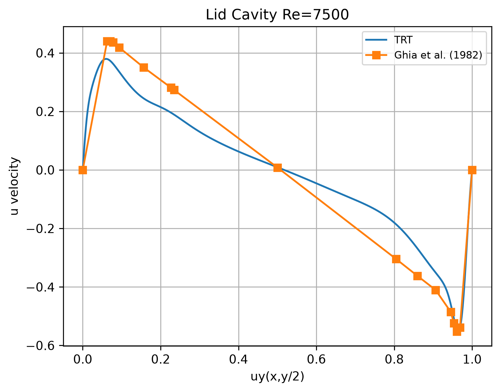

# Validation {#validation}

[TOC]

Four cases are used to check that the solver reproduces known physics. Three
have a closed-form solution and are scored against it directly; the fourth,
the lid-driven cavity, has none and is scored against the Ghia et al. (1982)
tables.

| Case | Dimension | Reference | Entry point |
|---|---|---|---|
| Couette flow | 2D | `analysis::CouetteSolution2D` | `LBMSimulation::compute_error()` |
| Poiseuille channel | 2D | `analysis::PoiseuilleSolution2D` | `LBMSimulation::compute_error()` |
| Hagen-Poiseuille pipe | 3D | `analysis::HagenPoiseuilleSolution3D` | `LBMSimulation::compute_error()` |
| Lid-driven cavity | 2D | Ghia et al. (1982) tables | `LBMSimulation::compute_ghia_error()` |
| Lid-driven cavity | 3D | none in-tree | export the profile, compare externally |

## Against an analytical solution

`compute_error()` takes only the exact solution and the norm; the approximate
field and the grid come from the simulation itself.

```cpp
const double err = simulation.compute_error(
    analysis::NormType::L2,
    analysis::PoiseuilleSolution2D(/*H*/ ny - 1, /*Umax*/ u_ref));
```

Internally this is the two-step split of `analysis::ErrorEvaluator`:
`integrate_difference()` builds a per-cell error field, then
`compute_global_error()` reduces it in the requested norm. Keeping the two
apart means the per-cell field can be exported to see *where* the error is,
and the norm can be changed without recomputing the difference.

The available norms are `L1`, `L2`, `L2_squared` and `Linfty`. The result is
**absolute and unnormalised**: there is no cell-volume weighting, because in
lattice units the cell measure is 1. Two different resolutions are therefore
only comparable after dividing by the cell count.

### Three things that make a converged run look wrong

**The wall is half a cell away from where you think.** With halfway
bounce-back the wall sits midway between the last fluid node and the first
solid node. For the pipe that means the effective radius is
`R = r_inner + 0.5`, where `r_inner` is what was handed to
`CylindricalShell`. Getting this wrong shifts the whole parabola.

**Solid nodes are included in the reduction.** `integrate_difference()`
iterates the entire grid, obstacle interiors included. Inside a wall the
solver leaves `u = 0`, so the exact solution has to return zero there as
well — which is exactly why `HagenPoiseuilleSolution3D` returns zero outside
the pipe instead of continuing the parabola into negative values.

**The transient is diffusive and long.** It scales as `L²/ν`. For the 129×129
Poiseuille channel that is `128²/0.129 ≈ 1.3e5` steps; below roughly `1e5`
iterations the profile has not settled and the L2 error stays high with
nothing actually wrong. The comments at the top of the shipped `.toml` files
carry the arithmetic for each case.

## Against the Ghia benchmark

```cpp
const analysis::NormErrorResult e =
    simulation.compute_ghia_error(LBM_BENCHMARKS_DIR "/ghia/data_y_100.txt",
                                  analysis::NormType::L2);
// e.relative, e.absolute, e.norm_type
```

The tables hold 17 points along a centreline per Reynolds number. The reader
checks the Reynolds number in the file header against `params.reyn_num` and
raises if they disagree, so a run cannot silently be scored against the wrong
table. The simulated centreline is interpolated linearly at the 17 tabulated
coordinates and divided by the lid velocity — Ghia's values are already
normalised that way, so it is the simulation that is rescaled, never the
reference.

Unlike `compute_error()`, this one returns **both** the absolute error and
the error relative to the norm of the reference, in a
`analysis::NormErrorResult`.

Defined for `dim == 2` only. Instantiating it on a 3D simulation is a compile
error; a 3D run that never calls it compiles fine.

## Measured errors

What the two entry points above return, on runs with TRT and 100 000
iterations. `rel` is the error relative to the norm of the reference; the RMS
column is `abs / sqrt(N)` expressed as a percentage of the reference scale
(`u_ref` for the analytical cases, `1.0` for Ghia's tables, which are already
normalised by the lid velocity).

| Case | Grid | Re | Profile | `rel` | RMS | `Linf` |
|------|------|---:|---------|------:|----:|-------:|
| Couette | 129x129 | 100 | `ux` | 0.39% | 0.23% | 0.39% |
| Poiseuille | 129x129 | 100 | `ux` | 4.62% | 3.36% | 5.10% |
| Lid cavity vs Ghia | 200x200 | 1000 | `uy` | 4.67% | 1.46% | 2.84% |
| Lid cavity vs Ghia | 200x200 | 1000 | `ux` | 3.23% | 1.32% | 3.78% |

Couette is essentially exact, which is the case to check first when something
looks wrong: a linear profile carries no truncation error in the bulk, so an
error above a fraction of a percent there means the walls, the moments or the
output normalisation are misbehaving. Poiseuille is an order of magnitude
worse on the same grid, and its `Linf` (5.10% of `u_ref`) is only 1.5 times its
RMS -- the error is a nearly uniform shortfall of the whole parabola rather
than a wall artefact. The cavity is the opposite: `Linf` is twice the RMS, so
the discrepancy sits in a few points near the extrema.

The raw CSVs, the derivation of each column and the two experiments that
discriminate between the candidate causes of the Poiseuille offset are in
`docs/report/error_results.md`.

## Measured profiles

The figures below come from runs of the shipped simulations; the timings of the
same machinery are in @ref performance. Each profile is written by
`LBMSimulation::output()` with an extractor from `lbm::functional` and plotted
with `scripts/py/visualize_profile.py`, which divides the samples by the
`u_ref` in the `%%profile` header -- the same normalisation Ghia's tables use,
so a curve below the reference is slower, not merely rescaled.

### Lid-driven cavity, Re = 7500

`D2Q9`, 2000x2000, BGK and TRT, against `benchmarks/ghia/data_y_7500.txt`. The
quantity is `v(x, ny/2)` -- the vertical velocity along the horizontal
centreline, from `functional::extract_dy_profile_along_x_center()`.




| | simulation | Ghia et al. | difference |
|---|---:|---:|---:|
| positive peak (x ~ 0.06) | +0.38 | +0.4403 | -14% |
| zero crossing | ~0.50 | 0.50 (+0.008) | -- |
| negative extremum (x ~ 0.96) | -0.54 | -0.5522 | -2% |

- **BGK and TRT overlap exactly at this scale.** In the comparison figure the
  green BGK curve covers the blue TRT one; the legend is the only evidence TRT
  is plotted. The two operators differ in how they relax the antisymmetric
  moments, which changes where a *curved* wall effectively sits -- a square
  cavity gives that difference nothing to act on.
- **Do not measure the middle of the plot by eye.** Ghia's table has 17 points
  and only one of them lies between x = 0.23 and x = 0.80;
  `visualize_profile.py` joins consecutive points with straight lines, so the
  apparently linear reference there is interpolation. `compute_ghia_error()`
  compares 17 pairs of numbers, interpolating the *simulation* onto the
  tabulated abscissas, and that is the figure to quote.
- **The 14% deficit on the positive peak is not a resolution problem.** One
  lattice spacing is 0.05% of the cavity side here. It is the long transient of
  this page's third pitfall: one flow-through time at `u = 0.1` on 2000 nodes
  is `L/u = 20000` steps, and a cavity at `Re = 7500` needs tens of those. The
  asymmetry of the error points the same way -- the extremum the lid drives
  into is already within 2%, while the one fed by the slower return flow lags.

### Hagen-Poiseuille pipe

`D3Q19` on the CUDA backend: a `CollisionDetection::CylindricalShell` inside a
box, pressure-periodic inlet and outlet on the `x` faces, profile taken with
`functional::extract_dx_profile_along_z_center()`.


- The parabola is symmetric about the axis to within the line width. Nothing in
  the setup enforces that: the wall is a rasterised shell, so a lopsided profile
  would have exposed a bias in how `compute_solid_mask()` walks it.
- **The flat zero shoulders are the solid nodes**, not stagnant fluid -- the
  same nodes this page warns about under *Solid nodes are included in the
  reduction*. The extractor samples the full width of the box while the pipe is
  inscribed in it, so two or three nodes at each end lie between the box face
  and the shell. `HagenPoiseuilleSolution3D` returns zero there, which is what
  keeps `compute_error()` from scoring the wall as a miss.
- The peak reaches 0.93 of the reference velocity. That residual is this page's
  first pitfall in numbers: the wall sits half a cell outside the last fluid
  node, so the effective radius is `r_inner + 0.5`, and on a 65-node
  cross-section half a cell is ~1.5% of the diameter -- which enters the
  parabola quadratically. It is a systematic offset and should shrink under
  refinement; `configs/pipe_config_3.toml` (100x125x125) is the run that checks
  it.

## The 3D cavity

There is no analytical solution and no tabulated equivalent in this library.
A 3D cavity run is validated by exporting the centreline profile with
`functional::extract_dx_profile_along_z_center()` and comparing it against
external reference data:

```bash
python scripts/py/visualize_profile.py out/profile_cavity3d.dat --title "Re = 100"
```

The 200x200x200 run at `Re = 1000`
([`configs/lid_cavity_3d.toml`](../../configs/lid_cavity_3d.toml)), animated
from the exported frames with `scripts/py/visualize_frames.py`:


What this establishes is qualitative -- the primary vortex forms under the lid
and the corner recirculations appear where they belong -- which is the most an
animation can do. The quantitative check is still the exported centreline
against external data.

## Checking the outputs structurally

```bash
python scripts/py/validate_outputs.py
```

Separate from the physics: it verifies headers, payload lengths, finite
values, and output paths declared twice by different sources. Run it before
trusting a plot.

## Reference

- U. Ghia, K. N. Ghia, C. T. Shin, *High-Re solutions for incompressible flow
  using the Navier-Stokes equations and a multigrid method*, Journal of
  Computational Physics 48 (1982) 387-411. A copy is in
  `docs/references/Ghia1982.pdf`, and the extracted tables are under
  `benchmarks/ghia/`.
