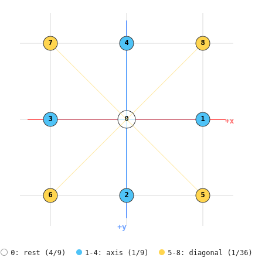
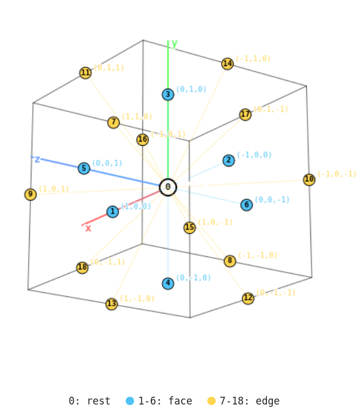
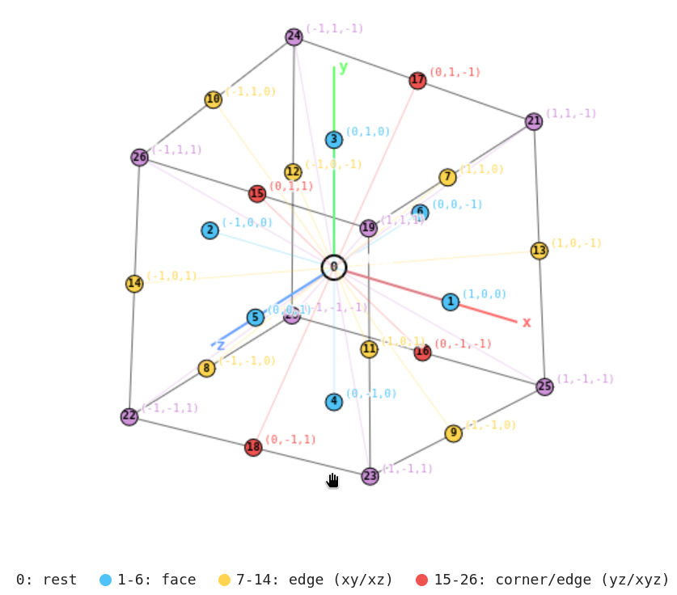

# Architecture

<!--toc:start-->
- [Architecture](#architecture)
  - [Velocity sets](#velocity-sets)
    - [D2Q9](#d2q9)
    - [D3Q19](#d3q19)
    - [D3Q27](#d3q27)
<!--toc:end-->

## Velocity sets

Each velocity set is a compile-time struct exposing `dim`, `ndir`, the weights
`wi[]`, the discrete directions `dir[]` and the opposite-direction table
`opp[]`.

**Numbering convention** (applies to every set below): directions are grouped
by type (face/axis, edge, vertex), and within each group of size `n` the
opposite of direction `i` is `i + n/2` (wrapping within the group). This is
the same rule used by `D2Q9`'s axis group (1↔3, 2↔4) and diagonal group
(5↔7, 6↔8), so `opp[]` is computed identically for every `Dd Qq` set instead
of needing a per-set lookup table.

### D2Q9
Each velocity set is a compile-time struct exposing `dim`, `ndir`, the weights
`wi[]`, the discrete directions `dir[]` and the opposite-direction table
`opp[]`. `D2Q9` uses the following numbering:

| i | c_i | Meaning | w_i |
|--:|:---:|---------|-----|
| 0 | ( 0, 0) | rest | 4/9 |
| 1 | (+1, 0) | east | 1/9 |
| 2 | ( 0,+1) | north | 1/9 |
| 3 | (-1, 0) | west | 1/9 |
| 4 | ( 0,-1) | south | 1/9 |
| 5 | (+1,+1) | north-east | 1/36 |
| 6 | (-1,+1) | north-west | 1/36 |
| 7 | (-1,-1) | south-west | 1/36 |
| 8 | (+1,-1) | south-east | 1/36 |

> The branch `feat/enhancement` changes this convention

### D3Q19

19 directions: rest, 6 face neighbours, 12 edge neighbours (no vertex diagonals).
Common compromise between isotropy and per-node cost for 3D cavity/channel flows.

| i | c_i | Meaning | w_i |
|--:|:---:|---------|-----|
| 0  | ( 0, 0, 0) | rest        | 1/3  |
| 1  | (+1, 0, 0) | +x face     | 1/18 |
| 2  | (-1, 0, 0) | -x face     | 1/18 |
| 3  | ( 0,+1, 0) | +y face     | 1/18 |
| 4  | ( 0,-1, 0) | -y face     | 1/18 |
| 5  | ( 0, 0,+1) | +z face     | 1/18 |
| 6  | ( 0, 0,-1) | -z face     | 1/18 |
| 7  | (+1,+1, 0) | xy edge     | 1/36 |
| 8  | (-1,-1, 0) | xy edge     | 1/36 |
| 9  | (+1,-1, 0) | xy edge     | 1/36 |
| 10 | (-1,+1, 0) | xy edge     | 1/36 |
| 11 | (+1, 0,+1) | xz edge     | 1/36 |
| 12 | (-1, 0,-1) | xz edge     | 1/36 |
| 13 | (+1, 0,-1) | xz edge     | 1/36 |
| 14 | (-1, 0,+1) | xz edge     | 1/36 |
| 15 | ( 0,+1,+1) | yz edge     | 1/36 |
| 16 | ( 0,-1,-1) | yz edge     | 1/36 |
| 17 | ( 0,+1,-1) | yz edge     | 1/36 |
| 18 | ( 0,-1,+1) | yz edge     | 1/36 |

> Directions are indexed in opposite pairs (1↔2, 3↔4, 5↔6, 7↔8, 9↔10, 11↔12,
13↔14, 15↔16, 17↔18), so `opp[i]` is a fixed swap and needs no lookup table
beyond a XOR-with-1 on the pair index if you renumber 1..18 as 0-based pairs.

### D3Q27

Adds the 8 vertex (corner) neighbours to D3Q19, at the cost of 8 extra
populations per node. Improves isotropy of the discrete velocity moments
(exact 4th-order Hermite quadrature) at higher memory/bandwidth cost —
this is the set already in use for the 3D BGK lid-cavity solver.

| i | c_i | Meaning | w_i |
|--:|:---:|---------|-----|
| 0  | ( 0, 0, 0) | rest        | 8/27  |
| 1  | (+1, 0, 0) | +x face     | 2/27  |
| 2  | (-1, 0, 0) | -x face     | 2/27  |
| 3  | ( 0,+1, 0) | +y face     | 2/27  |
| 4  | ( 0,-1, 0) | -y face     | 2/27  |
| 5  | ( 0, 0,+1) | +z face     | 2/27  |
| 6  | ( 0, 0,-1) | -z face     | 2/27  |
| 7  | (+1,+1, 0) | xy edge     | 1/54  |
| 8  | (-1,-1, 0) | xy edge     | 1/54  |
| 9  | (+1,-1, 0) | xy edge     | 1/54  |
| 10 | (-1,+1, 0) | xy edge     | 1/54  |
| 11 | (+1, 0,+1) | xz edge     | 1/54  |
| 12 | (-1, 0,-1) | xz edge     | 1/54  |
| 13 | (+1, 0,-1) | xz edge     | 1/54  |
| 14 | (-1, 0,+1) | xz edge     | 1/54  |
| 15 | ( 0,+1,+1) | yz edge     | 1/54  |
| 16 | ( 0,-1,-1) | yz edge     | 1/54  |
| 17 | ( 0,+1,-1) | yz edge     | 1/54  |
| 18 | ( 0,-1,+1) | yz edge     | 1/54  |
| 19 | (+1,+1,+1) | vertex      | 1/216 |
| 20 | (-1,-1,-1) | vertex      | 1/216 |
| 21 | (+1,+1,-1) | vertex      | 1/216 |
| 22 | (-1,-1,+1) | vertex      | 1/216 |
| 23 | (+1,-1,+1) | vertex      | 1/216 |
| 24 | (-1,+1,-1) | vertex      | 1/216 |
| 25 | (+1,-1,-1) | vertex      | 1/216 |
| 26 | (-1,+1,+1) | vertex      | 1/216 |

