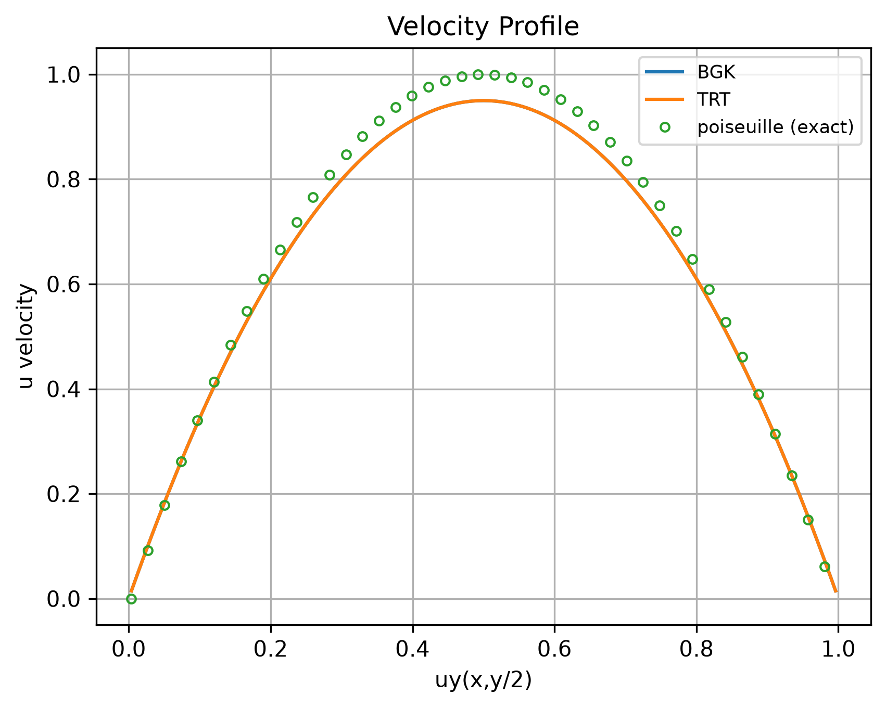
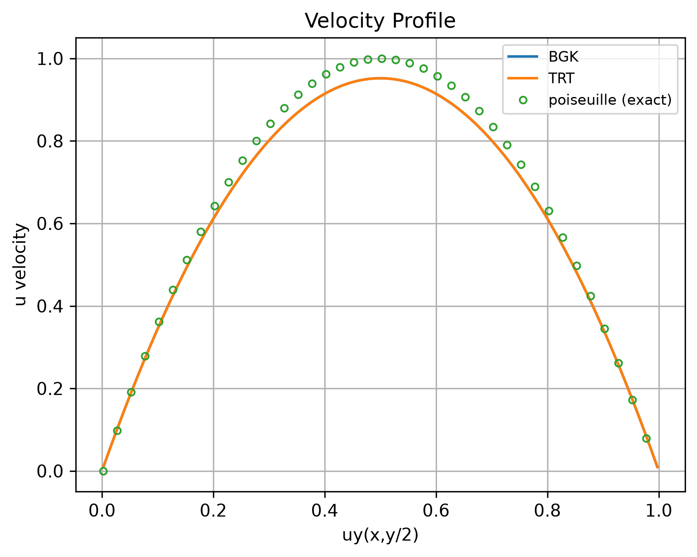

# Error Results

Quantitative validation of the solver against the two analytical solutions in
`lbm::analysis` and against the Ghia et al. (1982) tables. Every number on this
page comes from the CSVs in [`assets/`](assets), written by the runs
themselves -- nothing here was read off a plot.

## How the numbers are produced

Two entry points on `LBMSimulation`, both returning a scalar in a chosen norm:

- `compute_error(NormType, const Function<dim>&)` -- compares the whole
  velocity field against an analytical solution sampled at each node, and
  returns the **absolute** global error;
- `compute_ghia_error(path, NormType)` -- 2D lid-driven cavity only: it
  interpolates the simulated centerline at the 17 tabulated coordinates and
  returns a `NormErrorResult` carrying **both** the absolute and the relative
  error.

Each run appends one row per profile to an error CSV
(`analysis::ErrorAnalysisSchema`), next to the profile and frame output. All
the runs below use `NormType::L2`, TRT, 100 000 iterations, 16 threads.

### Reading the columns

The three files carry the same header:

```
profile,grid_x,grid_y,reynolds,collision_model,niters,type,
rel,abs,rel_percent,rmse,rmse_ref_percent,linf,linf_ref_percent,
runtime_s,threads,mlups
```

| Column | Meaning |
|--------|---------|
| `abs` | the global `L2` error, unnormalized, in lattice units. It is a **sum over the whole domain**, so it grows with the grid and is not comparable between resolutions |
| `rel` | `abs` divided by the `L2` norm of the reference field; this is the one to compare across cases |
| `rmse` | `abs / sqrt(N)`, the per-sample RMS error -- `N` is the number of nodes for an analytical comparison, the 17 tabulated points for a Ghia one |
| `rmse_ref_percent`, `linf_ref_percent` | the same quantities as a percentage of the reference scale: `u_ref = 0.1` for the analytical cases, `1.0` for Ghia's tables, which are already normalized by the lid velocity |
| `linf` | the largest single-node error: it says *how concentrated* the error is, which `rel` alone cannot |

The columns are self-consistent and can be checked by hand, which is worth
doing once before trusting a table of this kind. For Couette:
`abs / sqrt(129 * 129) = 2.9223e-02 / 129 = 2.2653e-04`, exactly the `rmse`
column; and `abs / rel = 7.46` is the `L2` norm of the exact field, which for
`u_x = 0.1 y/H` on a 129x129 grid is `0.1 * sqrt(129 * sum_y (y/128)^2) = 7.45`.

## Results

| Case | Grid | Re | Profile | `rel` | RMS (% of ref) | `Linf` (% of ref) | Reference |
|------|------|---:|---------|------:|---------------:|------------------:|-----------|
| Couette | 129x129 | 100 | `ux` | **0.39%** | 0.23% | 0.39% | `CouetteSolution2D` |
| Poiseuille | 129x129 | 100 | `ux` | **4.62%** | 3.36% | 5.10% | `PoiseuilleSolution2D` |
| Lid cavity | 200x200 | 1000 | `uy` | **4.67%** | 1.46% | 2.84% | Ghia, `data_y_1000.txt` |
| Lid cavity | 200x200 | 1000 | `ux` | **3.23%** | 1.32% | 3.78% | Ghia, `data_x_1000.txt` |

Raw values, as written by the runs:

| Case | `abs` | `rmse` | `linf` | runtime [s] | MLUPS |
|------|------:|-------:|-------:|------------:|------:|
| Couette | 2.9223e-02 | 2.2654e-04 | 3.8797e-04 | 16.32 | 101.9 |
| Poiseuille | 4.3328e-01 | 3.3588e-03 | 5.0978e-03 | 15.10 | 110.2 |
| Cavity `uy` | 6.0008e-02 | 1.4554e-02 | 2.8376e-02 | 40.07 | 99.8 |
| Cavity `ux` | 5.4476e-02 | 1.3212e-02 | 3.7830e-02 | 40.07 | 99.8 |

## What the numbers say

**Couette is essentially exact: 0.39% relative, 0.23% of `u_ref` in RMS.** This
is the expected outcome and a good sanity check on the whole chain -- the LBM
equilibrium reproduces a linear velocity profile without truncation error in
the bulk, so what is left is the wall treatment and the residual transient.
A Couette error of a few tenths of a percent means the boundary conditions, the
moments and the normalization in the output header are all doing what they
claim; had any of them been wrong, this is the case that would have shown it
first.

**Poiseuille is an order of magnitude worse on the same grid, at the same
Reynolds number, with the same operator and the same iteration count: 4.62%.**
The interesting column is `Linf`, at 5.10% of `u_ref`: the largest single-node
error is *larger than the RMS by only a factor 1.5*, and it matches the
centerline deficit visible in the profile plots below, where the simulated peak
settles around `0.95 u_max`. The error is therefore not a wall artefact
localized in a few nodes -- it is a nearly uniform shortfall of the whole
parabola, which is exactly what a mis-calibrated driving pressure drop or a
mis-placed effective wall produces.

Two candidate explanations, both cheap to discriminate:

1. **The pressure drop is calibrated on the nominal channel height.** `pin` is
   derived from `H = ny - 1`, while halfway bounce-back puts the walls half a
   lattice spacing beyond the last fluid node. Since `u_max` scales with `H^2`,
   a one-cell error in the effective height is worth about `2/128 = 1.6%` here
   -- the right sign, the right kind of behaviour, but not the full 5%.
2. **The TRT magic parameter.** `CollisionParams<dim, TRT>` hard-codes
   `Lambda = (tau+ - 1/2)(tau- - 1/2) = 1/4`, which makes the wall position
   independent of the viscosity. The value that places a bounce-back wall
   *exactly* midway for a parabolic profile is `Lambda = 3/16` (Ginzburg &
   d'Humieres); the docstring in `collision-params.hpp` claims 1/4 does this,
   and the Poiseuille error is where that claim can be tested.

The two experiments that separate them: re-run at 257x257 and see whether the
`Linf` percentage halves (explanation 1 predicts it shrinks as `1/H`,
explanation 2 predicts it stays put), and re-run with `Lambda = 3/16`, a
one-line change in the constructor.

**The cavity against Ghia is 3.2% and 4.7% at `Re = 1000` on 200x200 nodes.**
For a benchmark at this Reynolds number on a grid this coarse, a few percent on
both centerlines is a good result -- 200 nodes have to resolve boundary layers
whose thickness scales as `Re^-1/2`. Here the error structure is the opposite
of Poiseuille's: `Linf` is roughly twice the RMS on both profiles, so the
discrepancy is concentrated in a few points, which is where one expects it --
the extrema near the walls, and the points closest to the lid.

The two centerlines disagree by more than a third (3.23% against 4.67%), and
that asymmetry is itself information: `uy` along the horizontal centerline is
fed by the slower return flow of the primary vortex, and is the profile that
converges last. It is the same signature the `Re = 7500` run shows on the
figures in the README, where the extremum on the driven side is within 2% of
Ghia while the one on the returning side is 14% short.

> **On the runtime and MLUPS columns.** These runs are around 100-110 MLUPS on
> 16 threads, while the strong-scaling sweep reports 157 MLUPS on 16 threads
> for a comparable grid. They were not measured on the same machine, so the two
> tables must not be mixed: use the scaling sweep for performance claims and
> this table for accuracy claims.

## Profiles behind the numbers

Poiseuille, coarse channel -- 129x129, `Re = 100`:



Poiseuille, elongated channel -- 400x200, `Re = 100`:



Both plots show the same two things the table quantifies: the parabola is
recovered and vanishes at the walls, and its peak falls short of the analytical
one by about 5%. **BGK and TRT are indistinguishable at this scale** -- the BGK
curve lies underneath the TRT one. On a straight channel the two operators have
nothing to disagree about: they differ in how they relax the antisymmetric
moments, which changes where a *curved* wall effectively sits.

The lid-driven cavity profiles, at `Re = 7500` on 2000x2000, are in the README
alongside the discussion of the plot itself.

## Reproducing the table

The error CSV is written by the run, so reproducing the table means re-running
the case and reading the file it leaves behind:

```bash
./build/simulations/poiseuille_d2q9_trt configs/example.toml
```

> **The CSVs in `assets/` carry 17 columns; `analysis::ErrorAnalysisSchema` in
> this tree writes 7** (`profile,size,collision_model,niters,type,rel,abs`).
> The extended schema -- the one that also records `rmse`, `linf`, the
> percentages of the reference scale, and the runtime -- is not committed, so
> re-running today reproduces the errors but not the whole table. Committing
> that schema is worth doing before the next round of runs: the derived columns
> are what make the numbers comparable between cases.
