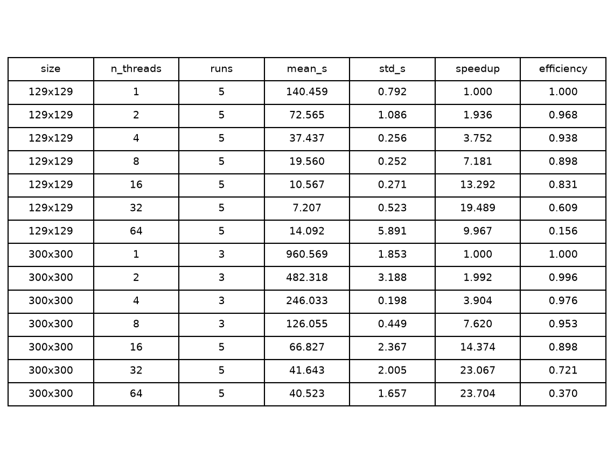
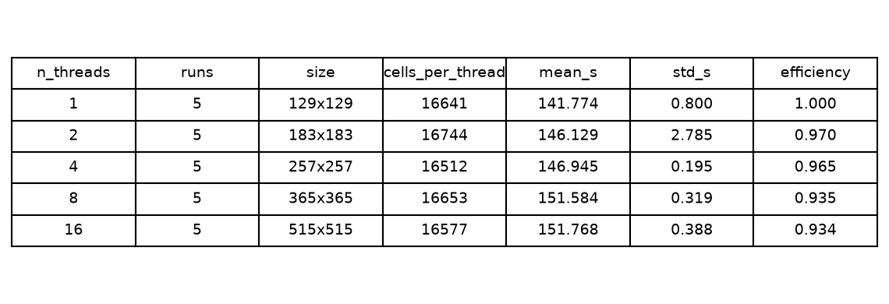

# Profiling

Timings come from the solver's own instrumentation: a build configured with
`-DLBM_ENABLE_PROFILING=ON` makes `OpenMPSolver` append one CSV row per timer,
and the row these plots use is `solve_total` -- the wall time of the iteration
loop, with initialization and output excluded. Every point is the mean over
repeated PBS jobs on one 64-core node.

## Strong scaling

Fixed grid, `Re = 100`, 100 000 iterations, threads from 1 to 64
([`configs/profiling.toml`](../../configs/profiling.toml)):

Efficiency holds at 0.90 up to 8 threads and 0.83 at 16, drops to 0.61 at 32,
and at 64 the time *rises* from 7.2 s to 14.1 s with the standard deviation
going from 0.5 s to 5.9 s -- contention, not saturation.

The flat 300x300 series is not a property of the solver: its wall time is the
same on 1 and on 64 threads, which means the extra threads never ran.

## Weak scaling

Grid grown with the thread count, same iteration count per point
([`configs/weak_scaling.toml`](../../configs/weak_scaling.toml)):

The first five points hold about 16 600 nodes per thread and the time stays
flat within 7%, which is what weak scaling should look like. The 32- and
64-thread points are a **second series** with 31 250 and 62 500 nodes per
thread, so their efficiency column restarts from its own baseline and reads
1.000 by construction.

## Full analysis

The detailed reading of both sweeps -- per-thread throughput in MLUPS, the
working-set table that explains the drop at 2000x2000, the diagnosis of the
300x300 series and the checklist for the next run -- is in
[`docs/pages/performance.md`](../pages/performance.md), which is also the page
rendered by Doxygen.
